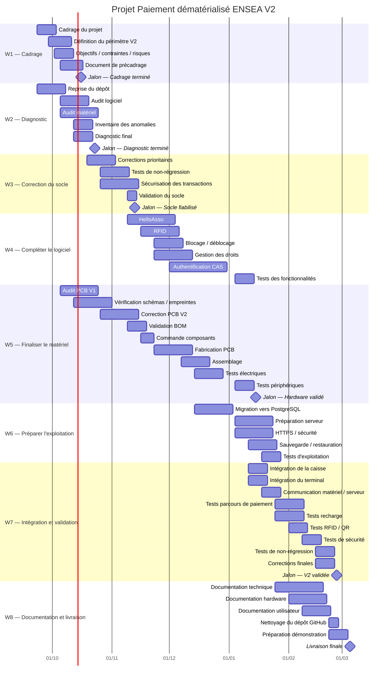

# Plateforme de paiement dématérialisé ENSEA

> Reprise et finalisation d'un système de paiement cashless destiné aux
> associations de l'ENSEA.

**Statut :** reprise du projet / développement en cours\
**Cadre :** projet étudiant ENSEA 2026--2027

------------------------------------------------------------------------

## 1. Présentation

Le projet vise à mettre en place une plateforme de paiement
dématérialisé pour les associations de l'ENSEA.

Le principe est de permettre à un étudiant de disposer d'un
**portefeuille prépayé**, puis d'utiliser ce solde pour effectuer des
achats auprès des associations de l'école.

L'identification prévue repose sur :

-   un **QR code dynamique** ;
-   à terme, la **carte étudiante RFID**.

Le système doit réunir :

-   une application web ;
-   une caisse ;
-   un terminal de paiement portable ;
-   une base de données ;
-   un système de recharge ;
-   des fonctions de suivi des ventes et des soldes.

Le projet est une **reprise d'un travail existant**. Une partie
importante du logiciel et du matériel existe déjà, mais doit être
vérifiée avant d'être considérée comme fonctionnelle.

> **Principe de reprise :** une fonctionnalité annoncée comme réalisée
> doit être testée et classée comme `conforme`, `défaillante` ou
> `non testable`.

------------------------------------------------------------------------

## 2. Objectifs de la V2

L'objectif de la V2 est de disposer d'un ensemble cohérent et
démontrable comprenant :

1.  une application de paiement fonctionnelle ;
2.  une caisse corrigée et testée ;
3.  un terminal de paiement corrigé et testé ;
4.  une identification par QR code et, si possible dans le périmètre
    retenu, par RFID ;
5.  une recharge en ligne réellement intégrée ;
6.  une gestion fiable des soldes et des transactions ;
7.  une documentation permettant la reprise du projet.

Le planning de travail proposé dans le précadrage est de **10
semaines**, à confirmer avec les encadrants.

------------------------------------------------------------------------

## 3. État actuel

### 3.1 Logiciel

  Élément                 État actuel
  ----------------------- -----------------------------------------------------
  Backend                 Django
  Base de développement   SQLite
  Interface               Templates Django + Bootstrap
  QR code                 QR dynamique / caméra du navigateur
  Paiement en ligne       HelloAsso prévu, intégration réelle à terminer
  RFID                    Champ `uid_rfid` présent, lecture réelle à intégrer
  Exports                 Excel avec `openpyxl`
  Emails                  Reçus et codes selon la configuration

### 3.2 Fonctionnalités déclarées comme réalisées

Le projet initial déclare notamment :

-   portefeuille prépayé par étudiant ;
-   débit/crédit atomique ;
-   paiement par QR code dynamique ;
-   vente catalogue ;
-   vente à montant libre ;
-   gestion du catalogue et des stocks ;
-   adhésions ;
-   recharge en espèces ;
-   rôles et droits par pôle ;
-   codes de sécurité ;
-   espace administrateur école ;
-   exports Excel ;
-   reçus par email ;
-   anonymisation après suppression de compte.

**Ces fonctionnalités doivent être vérifiées pendant la phase de
diagnostic.**

### 3.3 Fonctionnalités restantes identifiées

-   intégration réelle de HelloAsso ;
-   lecture RFID ;
-   blocage réversible d'un compte ou d'un QR compromis ;
-   tarif adhérent / non-adhérent ;
-   authentification CAS de l'école ;
-   passage à PostgreSQL ;
-   préparation de la mise en production ;
-   finalisation des CGU ;
-   V2 des PCB ;
-   éventuellement tableau de bord statistique et notifications.

Le périmètre définitif sera validé après le diagnostic.

------------------------------------------------------------------------

## 4. Architecture générale

``` text
                    +--------------------+
                    |      Étudiant      |
                    | QR / carte RFID    |
                    +---------+----------+
                              |
                              v
                    +--------------------+
                    | Application Django |
                    +---------+----------+
                              |
             +----------------+----------------+
             |                |                |
             v                v                v
       +-----------+    +-----------+    +-------------+
       |   Caisse  |    |  Terminal |    |   Recharge  |
       | Raspberry |    |  portable |    |   en ligne  |
       +-----------+    +-----------+    +-------------+
                              |
                              v
                    +--------------------+
                    |   Base de données  |
                    | comptes / soldes / |
                    | ventes / adhésions |
                    +--------------------+
```

------------------------------------------------------------------------

## 5. Fonctionnement cible d'un paiement

``` text
1. L'étudiant présente son QR code ou sa carte
                ↓
2. Le vendeur identifie l'étudiant
                ↓
3. L'application vérifie les droits et le solde
                ↓
4. Le paiement est accepté ou refusé
                ↓
5. Le solde étudiant est débité
                ↓
6. La recette du pôle est enregistrée
                ↓
7. La transaction est conservée dans l'historique
```

Les mécanismes exacts doivent être confirmés par les tests de reprise.

------------------------------------------------------------------------

## 6. Rôles

Le modèle applicatif repose sur des affectations associant un
utilisateur, un pôle, un rôle et éventuellement des droits
supplémentaires.

  -----------------------------------------------------------------------
  Rôle                    Portée                  Fonction principale
  ----------------------- ----------------------- -----------------------
  **Admin école**         Globale                 Comptes, rôles, codes
                                                  de sécurité, recettes
                                                  agrégées

  **Admin ADE**           Globale                 Gestion des pôles et
                                                  opérations ADE

  **Admin de pôle**       Un pôle                 Catalogue, événements,
                                                  équipe, adhésions,
                                                  exports

  **Vendeur**             Un pôle                 Encaissement et ventes
  -----------------------------------------------------------------------

------------------------------------------------------------------------

## 7. Matériel

Le projet comprend deux équipements électroniques.

### 7.1 Caisse

Éléments principaux identifiés :

-   Raspberry Pi 5 ;
-   alimentation ;
-   conversion 12 V → 5 V ;
-   commande du tiroir-caisse ;
-   périphériques d'encaissement.

Le PCB V1 existe mais présente des défauts identifiés dans la
documentation matérielle.

**Travail V2 :**

-   audit du schéma ;
-   vérification des empreintes ;
-   correction des composants de puissance ;
-   vérification de l'alimentation ;
-   vérification du routage ;
-   génération d'une BOM à jour ;
-   fabrication ;
-   tests électriques ;
-   tests fonctionnels.

### 7.2 Terminal portable

Éléments principaux identifiés :

-   Raspberry Pi Zero 2 W ;
-   HAT UPS Geekworm X306 ;
-   batterie 18650 ;
-   RC522 ;
-   écran OLED SSD1327 ;
-   périphériques d'identification et de signalisation.

Le PCB V1 doit également être vérifié et corrigé avant une nouvelle
fabrication.

> Le lecteur QR actuellement disponible est identifié comme **à
> revoir**, notamment concernant son interface. Ne pas commander une
> nouvelle série de cartes ou de composants avant validation.

------------------------------------------------------------------------

## 8. Structure du dépôt

``` text
2026_Stage_Caisse_Ensea/
│
├── README.md
│
├── Documents/
│   ├── conformite_reglementaire/
│   ├── Systèmes de paiment/
│   └── Réunion/
│
├── Hardware/
│   ├── README.md
│   ├── PROBLEMES_MATERIEL.md
│   ├── PCB_Caisse_Enregistreuse/
│   └── PCB_Caisse_Dématérialisée/
│
├── Software/
│   ├── README.md
│   ├── Raspberry/
│   ├── Diagramme_BDD/
│   ├── Tutoriel_Application_Cashless_ENSEA/
│   ├── First_Test_Appli_Django/
│   └── Ancienne_réflexion/
│
└── Images/
```

### Documents importants

  Besoin                           Document / dossier
  -------------------------------- ---------------------------------------
  Comprendre l'application         `Software/README.md`
  Comprendre la base et les flux   `Software/Diagramme_BDD/`
  Installer les Raspberry Pi       `Software/Raspberry/`
  Reprendre les PCB                `Hardware/README.md`
  Problèmes matériels connus       `Hardware/PROBLEMES_MATERIEL.md`
  Réglementation                   `Documents/conformite_reglementaire/`
  Benchmark / prestataires         `Documents/Systèmes de paiment/`
  Historique                       `Documents/Réunion/`

Les dossiers `Software/First_Test_Appli_Django/` et
`Software/Ancienne_réflexion/` sont historiques et ne décrivent pas
nécessairement l'architecture actuelle.

------------------------------------------------------------------------

## 9. Plan de reprise
## Planning du projet

Le projet a débuté le **23 septembre 2026** et la livraison est prévue
début **mars 2027**.

Le planning est structuré selon les lots du WBS présentés dans le document
de précadrage.



### Phase 1 --- Diagnostic

-   installer et lancer le logiciel ;
-   vérifier les dépendances ;
-   parcourir les fonctionnalités ;
-   inventorier le matériel ;
-   inspecter les deux PCB ;
-   tester les fonctions annoncées comme réalisées ;
-   établir le registre des anomalies.

**Livrable :** rapport de diagnostic.

### Phase 2 --- Fiabilisation

-   corriger les anomalies bloquantes ;
-   refaire les tests ;
-   vérifier qu'aucune fonction essentielle n'a été dégradée.

### Phase 3 --- Finalisation logiciel

Priorités identifiées :

-   recharge en ligne ;
-   RFID ;
-   blocage réversible ;
-   droits et limites ;
-   authentification CAS ;
-   PostgreSQL ;
-   préparation de l'exploitation.

### Phase 4 --- Finalisation matériel

-   corriger les PCB ;
-   valider les empreintes ;
-   finaliser la nomenclature ;
-   commander les composants ;
-   fabriquer les cartes ;
-   effectuer les tests d'alimentation ;
-   tester les périphériques ;
-   tester la communication avec l'application.

### Phase 5 --- Intégration

``` text
Application
     |
     +---- Caisse
     |
     +---- Terminal
              |
              +---- Identification étudiant
```

Effectuer ensuite les tests de bout en bout.

### Phase 6 --- Documentation

Livrer :

-   code ;
-   schémas ;
-   PCB ;
-   nomenclatures ;
-   procédures d'installation ;
-   procédures de test ;
-   documentation utilisateur ;
-   registre des anomalies ;
-   résultats de validation.

------------------------------------------------------------------------

## 10. Critères de validation proposés

Les critères suivants sont issus du précadrage et devront être confirmés
au lancement.

### Diagnostic

-   100 % des fonctionnalités annoncées sont testées ;
-   chaque élément est classé `conforme`, `défaillant` ou
    `non testable`.

### Matériel

-   caisse alimentée et démarrée correctement ;
-   terminal alimenté et démarré correctement ;
-   lecteurs et affichages fonctionnels ;
-   20 lectures successives d'une carte autorisée ;
-   refus d'une carte inconnue.

### Paiement

-   paiements acceptés correctement ;
-   paiements refusés correctement ;
-   absence de double débit ;
-   solde cohérent ;
-   stock cohérent.

### Livraison

-   20 achats de test consécutifs sans erreur de solde ou de stock ;
-   aucun défaut bloquant restant ;
-   documentation remise ;
-   démonstration réalisable par une personne extérieure au binôme à
    partir du guide.

> Ces critères sont des objectifs de validation et non la preuve que les
> fonctions sont déjà conformes.

------------------------------------------------------------------------

## 11. Planning indicatif

Le planning proposé dans le précadrage est de 10 semaines.

  Période   Étape           Objectif
  --------- --------------- --------------------------------------
  S1--S2    Diagnostic      Connaître l'état réel
  S3--S4    Fiabilisation   Corriger le socle
  S2--S7    Logiciel        Finaliser les fonctions prioritaires
  S2--S8    Matériel        Corriger et fabriquer les V2
  S3--S9    Exploitation    Hébergement, sécurité, sauvegarde
  S6--S10   Intégration     Tester l'ensemble
  S8--S10   Documentation   Préparer la livraison

### Jalons

-   **J0 --- S1 :** lancement ;
-   **J1 --- S2 :** diagnostic ;
-   **J2 --- S4 :** socle fiabilisé ;
-   **J3 --- S8 :** ensemble intégré ;
-   **J4 --- S10 :** réception pédagogique.

------------------------------------------------------------------------

## 12. Risques principaux

  ------------------------------------------------------------------------
  Risque                                      Niveau Action
  --------------------- ---------------------------- ---------------------
  État réel différent                          Élevé Diagnostic initial
  de la documentation                                complet

  Défauts PCB /                                Élevé Audit matériel avant
  composants                                         commande

  Retard                                       Élevé Identifier tôt les
  d'approvisionnement                                composants critiques

  Intégration HelloAsso                  Moyen/élevé Obtenir les accès et
                                                     tester les scénarios

  Erreur de solde /                            Élevé Tests transactionnels
  double paiement                                    et cas limites

  Accès non autorisé                           Élevé Tester rôles,
                                                     blocages et
                                                     authentification

  Perte de données                             Élevé Sauvegarde et
                                                     restauration

  Périmètre trop                               Élevé Prioriser les
  important                                          fonctions
                                                     essentielles
  ------------------------------------------------------------------------

------------------------------------------------------------------------

## 13. Décisions encore à prendre

Avant de considérer la V2 comme figée :

-   date officielle de livraison ;
-   répartition nominative des responsabilités ;
-   budget et responsable des commandes ;
-   utilisateurs pilotes ;
-   périmètre exact de la V2 ;
-   lecteur QR retenu ;
-   stratégie RFID ;
-   environnement d'hébergement ;
-   accès HelloAsso ;
-   intégration CAS ;
-   base PostgreSQL ;
-   règles de gestion et de remboursement des soldes ;
-   conditions d'utilisation avec de l'argent réel.

------------------------------------------------------------------------

## 14. Règles importantes pour la reprise

1.  **Ne pas considérer une fonctionnalité comme acquise sans test.**
2.  **Ne pas modifier le matériel avant d'avoir documenté l'état V1.**
3.  **Ne pas commander les PCB V2 avant validation des schémas,
    empreintes et BOM.**
4.  **Ne jamais utiliser de `float` pour les montants monétaires :
    utiliser `Decimal`.**
5.  **Les transactions de solde doivent rester atomiques et protégées
    contre les accès concurrents.**
6.  **Ne pas supprimer physiquement les comptes si cela détruit
    l'historique nécessaire ; suivre la politique d'anonymisation
    prévue.**
7.  **Les documents historiques ne décrivent pas nécessairement
    l'architecture actuelle.**
8.  **L'utilisation avec de l'argent réel est une décision distincte de
    la démonstration technique.**

------------------------------------------------------------------------

## 15. État du document

  Élément                Valeur
  ---------------------- ---------------------------------
  Version                0.1
  Statut                 Brouillon de reprise
  Projet                 Paiement dématérialisé ENSEA V2
  Source principale      README initial du projet
  Complément             Document de précadrage V2
  Dernière mise à jour   À renseigner

------------------------------------------------------------------------

## Licence

Projet interne ENSEA --- usage restreint aux associations et acteurs
autorisés de l'école.
