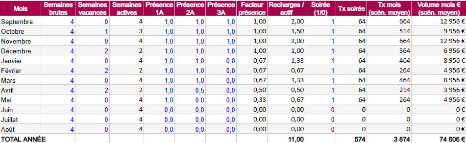
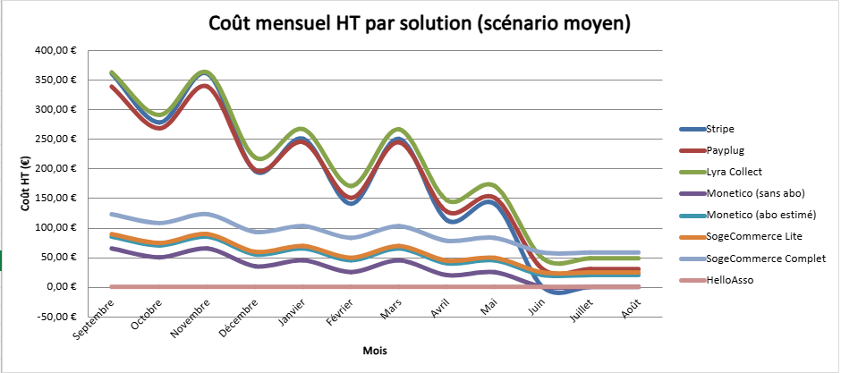
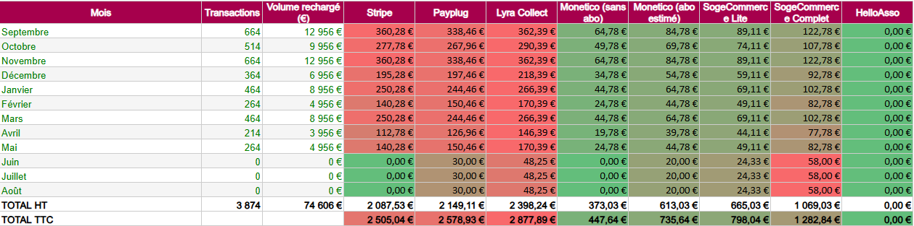
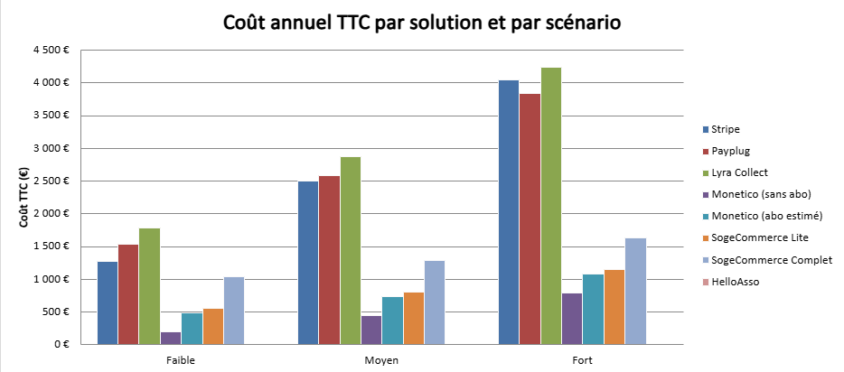
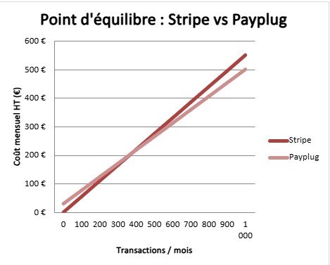
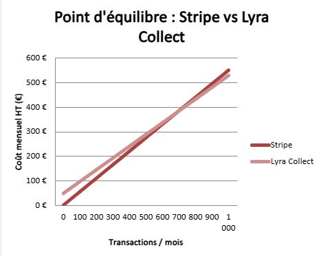

# Analyse comparative des solutions de paiement - Business model

> **Auteur :** Maxime RAMBARANE-BARAT - Stage ENSEA 2026  
> **Date :** Juin 2026  
> **Contexte :** Le projet de paiement dématérialisé de l'ENSEA repose sur un portefeuille virtuel rechargeable en ligne par carte bancaire. Le choix du prestataire de paiement qui encaisse ces rechargements a un impact financier direct sur les associations, qui prennent les frais à leur charge. Ce document synthétise le business model construit pour comparer les solutions selon trois scénarios d'adoption, et identifier la plus rentable pour le projet.

---

## 1. Hypothèses du modèle

| Hypothèse | Valeur |
|-----------|--------|
| Étudiants actifs, scénario faible | 150 |
| Étudiants actifs, scénario moyen | 300 |
| Étudiants actifs, scénario fort | 450 |
| Rechargement moyen (faible / moyen / fort) | 15 € / 20 € / 25 € |
| Fréquence de rechargement | 1 rechargement toutes les 2 semaines |
| Soirées | 1 par mois actif, 150 participants, dont 42 % rechargent 15 € en plus |
| Frais | À la charge des associations, non répercutés sur les étudiants |
| TVA | 20 % |

*Note sur le calendrier scolaire : le modèle tient compte de la présence réelle des cohortes. Les 1A sont présents de septembre à fin mai, les 2A de septembre à mi-avril, les 3A de septembre à décembre. Les vacances (1 semaine en octobre, 2 en décembre, 2 en février, 2 en avril) réduisent le nombre de semaines actives. Les mois d'été sont sans activité.*

---

## 2. Solutions étudiées

| Solution | % par transaction | Fixe par transaction | Abonnement HT/mois | Frais d'entrée HT |
|----------|------------------|----------------------|--------------------|--------------------|
| Stripe | 1,5 % | 0,25 € | 0 € | 0 € |
| Payplug | 1,1 % | 0,25 € | 30 € | 0 € |
| Lyra Collect | 1,4 % | 0,20 € | 40 € | 99 € |
| Monetico (sans abo) | 0,5 %* | 0 € | 0 € | 0 € |
| Monetico (abo estimé) | 0,5 %* | 0 € | 20 €* | 0 € |
| SogeCommerce Lite | 0,5 %* | 0 € | 16 € | 100 € |
| SogeCommerce Complet | 0,5 %* | 0 € | 33 € | 300 € |
| HelloAsso | 0 % | 0 € | 0 € | 0 € |

*\* Les taux Monetico et SogeCommerce sont des hypothèses : ces commissions ne sont pas publiques et se négocient avec la banque. La valeur de 0,5 % est une estimation basse réaliste, à confirmer par un devis.*

---

## 3. Calendrier scolaire et volume d'activité

Le volume de transactions varie fortement selon les mois. Les mois pleins (septembre, novembre, janvier, mars) concentrent l'essentiel de l'activité avec environ 660 transactions. Les mois creux (décembre, février, avril) tombent à 200 ou 360 transactions à cause des vacances et des départs progressifs des cohortes. Les mois d'été (juin, juillet, août) sont totalement inactifs : aucune transaction, mais les abonnements continuent de courir.

Sur l'année complète, le scénario moyen génère environ 3 874 transactions pour 74 606 € rechargés.

---

## 4. Comparatif mensuel (scénario moyen)

Totaux annuels dans le scénario moyen :

| Solution | Total HT/an | Total TTC/an |
|----------|------------|--------------|
| HelloAsso | 0,00 € | 0,00 € |
| Monetico (sans abo) | 373,03 € | 447,64 € |
| Monetico (abo estimé) | 613,03 € | 735,64 € |
| SogeCommerce Lite | 665,03 € | 798,04 € |
| SogeCommerce Complet | 1 069,03 € | 1 282,84 € |
| Stripe | 2 087,53 € | 2 505,04 € |
| Payplug | 2 149,11 € | 2 578,93 € |
| Lyra Collect | 2 398,24 € | 2 877,89 € |

La fourchette de coûts va de 0 € à 2 877,89 € TTC par an : l'écart entre la solution la moins chère et la plus chère est considérable pour un budget associatif.

Les abonnements fixes pèsent lourd les mois creux : en juin, juillet et août, il n'y a aucune transaction, mais Payplug facture toujours ses 30 € mensuels et Lyra ses 40 €. Sur trois mois d'été, cela représente 90 € à 120 € HT payés pour un service inutilisé. C'est ce qui explique qu'une solution avec des frais par transaction plus bas peut finir l'année plus chère qu'une solution sans abonnement.

---

## 5. Comparatif annuel : 3 scénarios

### Scénario faible (150 actifs, 15 €)

| Solution | Coût TTC/an | Rang |
|----------|------------|------|
| HelloAsso | 0 € | 1 |
| Monetico (sans abo) | 200 € | 2 |
| Monetico (abo estimé) | 488 € | 3 |
| SogeCommerce Lite | 551 € | 4 |
| SogeCommerce Complet | 1 035 € | 5 |
| Stripe | 1 268 € | 6 |
| Payplug | 1 539 € | 7 |
| Lyra Collect | 1 789 € | 8 |

### Scénario moyen (300 actifs, 20 €)

| Solution | Coût TTC/an | Rang |
|----------|------------|------|
| HelloAsso | 0 € | 1 |
| Monetico (sans abo) | 448 € | 2 |
| Monetico (abo estimé) | 736 € | 3 |
| SogeCommerce Lite | 798 € | 4 |
| SogeCommerce Complet | 1 283 € | 5 |
| Stripe | 2 505 € | 6 |
| Payplug | 2 579 € | 7 |
| Lyra Collect | 2 878 € | 8 |

### Scénario fort (450 actifs, 25 €)

| Solution | Coût TTC/an | Rang |
|----------|------------|------|
| HelloAsso | 0 € | 1 |
| Monetico (sans abo) | 794 € | 2 |
| Monetico (abo estimé) | 1 082 € | 3 |
| SogeCommerce Lite | 1 145 € | 4 |
| SogeCommerce Complet | 1 629 € | 5 |
| Payplug | 3 836 € | 6 |
| Stripe | 4 040 € | 7 |
| Lyra Collect | 4 244 € | 8 |

Trois enseignements ressortent de ces classements. Les solutions bancaires sont largement en tête dans tous les scénarios, si les taux négociés se confirment. HelloAsso est à 0 € partout, mais ses CGU restent à valider pour notre cas d'usage. Et Stripe devance Payplug dans les scénarios faible et moyen : ce n'est qu'à fort volume que l'abonnement de Payplug s'amortit et le fait passer devant.

---

## 6. Point d'équilibre

  
  

Le point d'équilibre répond à une question simple : à partir de quel volume mensuel une solution avec abonnement devient-elle moins chère que Stripe ? Tant que le volume est en dessous de ce seuil, l'abonnement coûte plus cher que ce que les frais réduits font économiser. Au-dessus, la solution avec abonnement devient gagnante.

| Solution | Coût fixe mensuel HT | Économie par transaction vs Stripe | Transactions/mois pour l'équilibre | Volume €/mois | Étudiants actifs équivalents |
|----------|---------------------|-----------------------------------|-----------------------------------|---------------|------------------------------|
| Payplug | 30,00 € | 0,08 € | 375 | 7 500 € | 188 |
| Lyra Collect | 48,25 € | 0,07 € | 689 | 13 786 € | 345 |
| Monetico (abo estimé) | 20,00 € | 0,45 € | 44 | 889 € | 22 |
| SogeCommerce Lite | 24,33 € | 0,45 € | 54 | 1 081 € | 27 |
| SogeCommerce Complet | 58,00 € | 0,45 € | 129 | 2 578 € | 64 |

Concrètement, Payplug a besoin de 188 étudiants actifs rechargeant deux fois par mois pour battre Stripe, et Lyra Collect en a besoin de 345. À l'inverse, les solutions bancaires atteignent leur équilibre dès 22 à 64 étudiants actifs, grâce à leur taux par transaction beaucoup plus bas.

*Attention : la moyenne mensuelle du scénario moyen est d'environ 322 transactions, ce qui est en dessous du point d'équilibre de Payplug (375). C'est pour cela que Stripe reste devant Payplug même à 300 actifs : les mois creux tirent la moyenne vers le bas.*

---

## 7. Enseignements et recommandations

1. **HelloAsso reste la solution la moins chère** (0 €), mais ses CGU doivent être validées impérativement pour le cas d'usage wallet avant de trancher.

2. **Les solutions bancaires (Monetico, SogeCommerce) sont les plus compétitives** si les taux négociés (hypothèse 0,5 %) se confirment. Il faut contacter les banques pour obtenir les vrais chiffres avant toute décision.

3. **Désavantage des solutions bancaires :** si l'ADE change de banque, la solution de paiement change avec, ce qui peut poser un problème de continuité du système.

4. **Stripe est plus économique que Payplug et Lyra Collect** dans les scénarios faible et moyen. Leurs abonnements ne s'amortissent qu'à fort volume.

5. **La fourchette de coût annuel va de 0 € à 2 877,89 €** dans le scénario moyen. L'écart est significatif et justifie de prendre le temps de valider les hypothèses avant de signer quoi que ce soit.

---

## 8. Actions suivantes

- [ ] Contacter Monetico (Crédit Mutuel / CIC) pour obtenir les taux réels et les conditions pour une association
- [ ] Contacter SogeCommerce (Société Générale) pour la même chose
- [ ] Valider avec HelloAsso que le cas d'usage wallet rechargeable est autorisé dans leurs CGU
- [ ] Confirmer dans quelle banque l'ADE a son compte, ce qui peut orienter directement le choix

---

*Document rédigé par Maxime RAMBARANE-BARAT, Stage ENSEA 2026*  
*Dernière mise à jour : juin 2026*