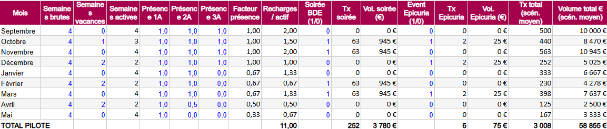
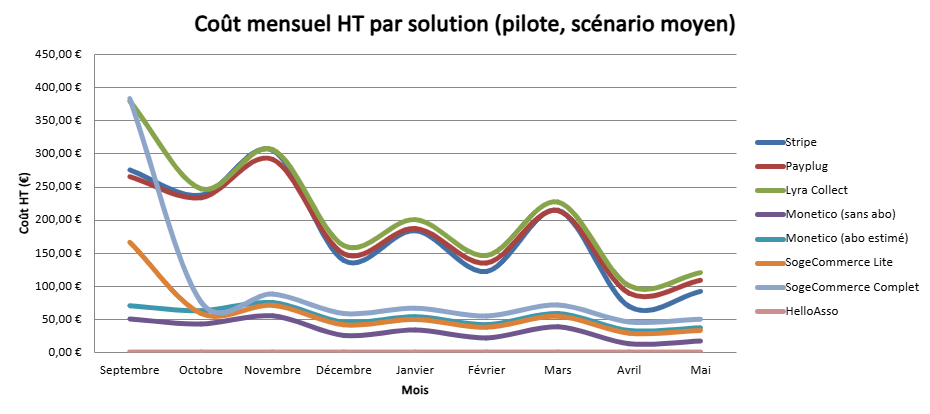
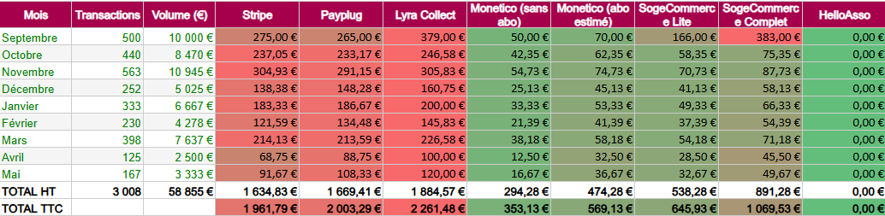
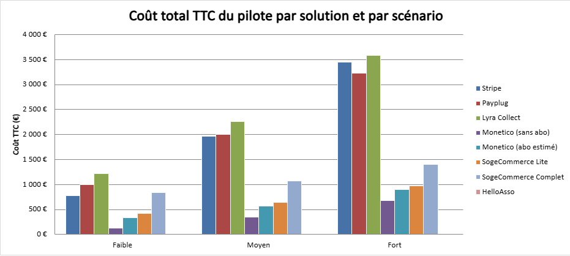

# Analyse comparative des solutions de paiement - Business model pilote ADE

> **Auteur :** Maxime RAMBARANE-BARAT - Stage ENSEA 2026  
> **Date :** Juin 2026  
> **Contexte :** Ce document synthétise le business model du pilote ADE (Kfet, BDE, Epicuria) sur la période septembre 2026 à mai 2027, soit 9 mois. Il est complémentaire au modèle annuel qui projette le système à pleine capacité. L'objectif ici est d'avoir le coût réel de démarrage, frais d'entrée inclus en one-shot, pour prendre une décision éclairée avant le déploiement.

---

## 1. Hypothèses du modèle

| Hypothèse | Valeur |
|-----------|--------|
| Étudiants actifs, scénario faible | 100 |
| Étudiants actifs, scénario moyen | 250 |
| Étudiants actifs, scénario fort | 400 |
| Rechargement moyen (faible / moyen / fort) | 15 € / 20 € / 25 € |
| Fréquence de rechargement | 1 rechargement toutes les 2 semaines |
| Soirées BDE | 4 dans l'année (octobre, novembre, février, mars), 150 participants, dont 42 % rechargent 15 € |
| Events Epicuria | 3 dans l'année, volume estimé à 25 € par event |
| Frais | À la charge des associations, non répercutés sur les étudiants |
| TVA | 20 % |
| Frais d'entrée | Affichés en one-shot (pas étalés) pour refléter le coût réel de démarrage |

*Note sur le calendrier scolaire : le modèle tient compte de la présence réelle des cohortes. Les 1A sont présents de septembre à fin mai, les 2A de septembre à mi-avril, les 3A de septembre à décembre. Les vacances (1 semaine en octobre, 2 en décembre, 2 en février, 2 en avril) réduisent le nombre de semaines actives. La Kfet suit ce même calendrier.*

---

## 2. Solutions étudiées

| Solution | % par transaction | Fixe par transaction | Abonnement HT/mois | Frais d'entrée HT |
|----------|------------------|----------------------|--------------------|--------------------|
| Stripe | 1,5 % | 0,25 € | 0 € | 0 € |
| Payplug | 1,1 % | 0,25 € | 30 € | 0 € |
| Lyra Collect | 1,4 % | 0,20 € | 40 € | 99 € |
| Monetico (sans abo) | 0,5 %* | 0 € | 0 € | 0 € |
| Monetico (abo estimé) | 0,5 %* | 0 € | 20 €* | 0 € |
| SogeCommerce Lite | 0,5 %* | 0 € | 16 € | 100 € |
| SogeCommerce Complet | 0,5 %* | 0 € | 33 € | 300 € |
| HelloAsso | 0 % | 0 € | 0 € | 0 € |

*\* Les taux Monetico et SogeCommerce sont des hypothèses : ces commissions ne sont pas publiques et se négocient avec la banque. La valeur de 0,5 % est une estimation basse réaliste, à confirmer par un devis.*

---

## 3. Calendrier scolaire et volume d'activité

Le volume de transactions varie selon les mois. Les mois pleins (septembre, novembre, janvier, mars) concentrent l'essentiel de l'activité, amplifiés par les soirées BDE en octobre, novembre, février et mars. Les mois creux (décembre, février, avril) chutent à cause des vacances et des départs progressifs des cohortes. Le mois de mai reste actif mais plus faible, car seules les 1A sont encore présentes.

Sur les 9 mois du pilote, le scénario moyen génère environ 3 008 transactions pour 58 855 € rechargés.

---

## 4. Comparatif mensuel (scénario moyen)

Totaux sur les 9 mois du pilote dans le scénario moyen :

| Solution | Total HT | Total TTC |
|----------|----------|-----------|
| HelloAsso | 0,00 € | 0,00 € |
| Monetico (sans abo) | 294,27 € | 353,13 € |
| Monetico (abo estimé) | 474,27 € | 569,13 € |
| SogeCommerce Lite | 538,27 € | 645,93 € |
| SogeCommerce Complet | 891,27 € | 1 069,53 € |
| Stripe | 1 634,83 € | 1 961,79 € |
| Payplug | 1 669,40 € | 2 003,29 € |
| Lyra Collect | 1 884,57 € | 2 261,48 € |

La fourchette de coûts sur le pilote va de 0 € à 2 261,48 € TTC. L'effet le plus visible sur ce graphique est le pic de septembre pour les solutions avec frais d'entrée : Lyra Collect affiche plus de 380 € ce premier mois à cause de la mise en service de 99 € payée en one-shot. Le même effet se voit pour SogeCommerce Lite (100 € d'entrée) et SogeCommerce Complet (300 € d'entrée).

Le coût suit l'activité de l'école pour les solutions sans abonnement, alors que les solutions à abonnement gardent un coût plancher même quand il ne se passe rien.

---

## 5. Comparatif total pilote : 3 scénarios

### Scénario faible (100 actifs, 15 €) - 20 355 € rechargés

| Solution | Coût HT | Coût TTC | Rang |
|----------|---------|----------|------|
| HelloAsso | 0,00 € | 0,00 € | 1 |
| Monetico (sans abo) | 101,78 € | 122,13 € | 2 |
| Monetico (abo estimé) | 281,77 € | 338,13 € | 3 |
| SogeCommerce Lite | 345,77 € | 414,93 € | 4 |
| Stripe | 644,83 € | 773,79 € | 5 |
| SogeCommerce Complet | 698,77 € | 838,53 € | 6 |
| Payplug | 833,40 € | 1 000,09 € | 7 |
| Lyra Collect | 1 015,57 € | 1 218,68 € | 8 |

### Scénario moyen (250 actifs, 20 €) - 58 855 € rechargés

| Solution | Coût HT | Coût TTC | Rang |
|----------|---------|----------|------|
| HelloAsso | 0,00 € | 0,00 € | 1 |
| Monetico (sans abo) | 294,27 € | 353,13 € | 2 |
| Monetico (abo estimé) | 474,27 € | 569,13 € | 3 |
| SogeCommerce Lite | 538,27 € | 645,93 € | 4 |
| SogeCommerce Complet | 891,27 € | 1 069,53 € | 5 |
| Stripe | 1 634,83 € | 1 961,79 € | 6 |
| Payplug | 1 669,40 € | 2 003,29 € | 7 |
| Lyra Collect | 1 884,57 € | 2 261,48 € | 8 |

### Scénario fort (400 actifs, 25 €) -  113 855 € rechargés

| Solution | Coût HT | Coût TTC | Rang |
|----------|---------|----------|------|
| HelloAsso | 0,00 € | 0,00 € | 1 |
| Monetico (sans abo) | 569,27 € | 683,13 € | 2 |
| Monetico (abo estimé) | 749,27 € | 899,13 € | 3 |
| SogeCommerce Lite | 813,27 € | 975,93 € | 4 |
| SogeCommerce Complet | 1 166,28 € | 1 399,53 € | 5 |
| Payplug | 2 686,91 € | 3 224,29 € | 6 |
| Stripe | 2 872,32 € | 3 446,79 € | 7 |
| Lyra Collect | 2 984,57 € | 3 581,48 € | 8 |

Les mêmes enseignements que dans le modèle annuel se confirment sur le pilote. Les solutions bancaires restent largement en tête dans tous les scénarios. HelloAsso est à 0 € partout, mais ses CGU restent à valider. Stripe devance Payplug dans les scénarios faible et moyen : ce n'est qu'au scénario fort que l'abonnement de Payplug commence à s'amortir et le fait passer devant Stripe.

---

## 6. Point d'équilibre

*Le point d'équilibre du pilote est identique au modèle annuel car il dépend uniquement des taux par transaction et des abonnements mensuels, pas de la durée. Se référer à la section 6 du document Business_model_analyse.md.*

| Solution | Coût fixe mensuel HT | Économie par transaction vs Stripe | Transactions/mois pour l'équilibre | Étudiants actifs équivalents |
|----------|---------------------|-----------------------------------|-----------------------------------|------------------------------|
| Payplug | 30,00 € | 0,08 € | 375 | 188 |
| Lyra Collect | 48,25 € | 0,07 € | 689 | 345 |
| Monetico (abo estimé) | 20,00 € | 0,45 € | 44 | 22 |
| SogeCommerce Lite | 24,33 € | 0,45 € | 54 | 27 |
| SogeCommerce Complet | 58,00 € | 0,45 € | 129 | 64 |

---

## 7. Enseignements et recommandations

1. **HelloAsso reste la solution la moins chère** (0 €), mais ses CGU doivent être validées impérativement pour le cas d'usage wallet avant de trancher.

2. **Les solutions bancaires (Monetico, SogeCommerce) sont les plus compétitives** si les taux négociés (hypothèse 0,5 %) se confirment. Il faut contacter les banques pour obtenir les vrais chiffres avant toute décision.

3. **Désavantage des solutions bancaires :** si l'ADE change de banque, la solution de paiement change avec, ce qui peut poser un problème de continuité du système.

4. **Stripe est plus économique que Payplug et Lyra Collect** dans les scénarios faible et moyen. Leurs abonnements ne s'amortissent qu'à fort volume, et les 9 mois du pilote ne suffisent pas à les rentabiliser.

5. **La fourchette de coût sur le pilote va de 0 € à 2 261,48 € TTC** dans le scénario moyen. Les frais d'entrée one-shot rendent Lyra et SogeCommerce Complet particulièrement coûteux au démarrage.

---

## 8. Actions suivantes

- [ ] Contacter Monetico (Crédit Mutuel / CIC) pour obtenir les taux réels et les conditions pour une association
- [ ] Contacter SogeCommerce (Société Générale) pour la même chose
- [ ] Valider avec HelloAsso que le cas d'usage wallet rechargeable est autorisé dans leurs CGU
- [ ] Confirmer dans quelle banque l'ADE a son compte, ce qui peut orienter directement le choix

---

*Document rédigé par Maxime RAMBARANE-BARAT - Stage ENSEA 2026*
*Dernière mise à jour : juin 2026*