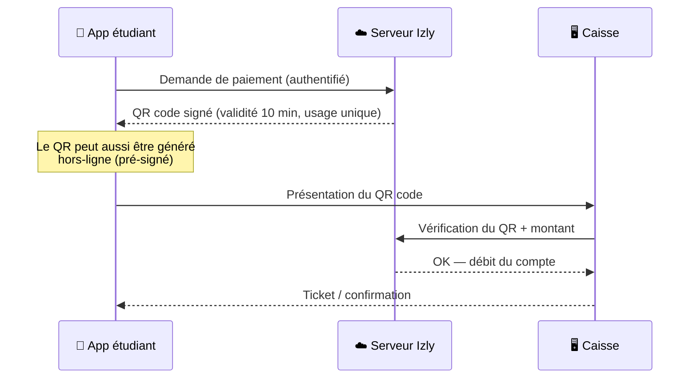

# Benchmark - Systèmes de paiement étudiants existants
### Ce que font les autres écoles, ce qu'on peut en apprendre

> **Auteur :** Maxime RAMBARANE-BARAT - Stage ENSEA 2026  
> **Contexte :** Action issue de la réunion du 05 juin 2026 avec Mr Moubêche - « d'autres écoles font peut-être la même chose, autant s'en inspirer »  
> **Voir aussi :** `Analyse_des_solutions_de_paiement_alternative_.md` · `Conformite_reglementaire.md`

---

## Synthèse rapide

| Système | École / Structure | Statut | Code source | Stack | Pertinence pour nous |
|---|---|---|---|---|---|
| **Note Kfet** | ENS Paris-Saclay (BDE) | ✅ En production depuis 2014 | ✅ Open source (GPLv3) | Django | ⭐⭐⭐ Le plus proche de notre projet |
| **BDE ISIMA** | ISIMA Clermont-Ferrand | ✅ En production | ✅ Open source (GitHub) | Next.js / Blitz | ⭐⭐ Wallet virtuel web |
| **TiBillet** | Tiers-lieux / événementiel (hors école) | ✅ En production | ✅ Open source | Django + Raspberry Pi + NFC | ⭐⭐⭐ Architecture matérielle identique à la nôtre |
| **Pay'UTC / Nemopay** | UTC Compiègne | ✅ En production (devenu commercial) | 🔶 Partiel (app mobile) | API propriétaire Nemopay | ⭐⭐ Trajectoire de référence : du projet étudiant à l'entreprise |
| **App ECAM Lyon** | ECAM LaSalle | ❓ Non documentée publiquement | ❌ Rien trouvé | Inconnue | ⭐ À investiguer par contact direct |
| **Izly** | CROUS (national) | ✅ En production, ~700 000 utilisateurs | ❌ Propriétaire | App mobile + QR + carte | ⭐⭐⭐ Référence UX et réglementaire |

---

## 1. Note Kfet - ENS Paris-Saclay ⭐ le grand frère de notre projet

**Ce que c'est.** La « Note » est le porte-monnaie virtuel du BDE de l'ENS Paris-Saclay, en production depuis octobre 2014 (version actuelle « Note Kfet 2020 » déployée en septembre 2020). C'est LE moyen de paiement du campus : achats à la Kfet, activités du BDE, et même remboursements entre amis. Le nom « Kfet » n'est pas une coïncidence - c'est exactement le même concept que le nôtre, dans une école similaire.

**Fonctionnement.**
- Chaque adhérent BDE possède une « note » (un compte) avec un solde
- Rechargement : espèces, chèque, **CB via un TPE physique** à la Kfet, ou virement bancaire - pas de rechargement en ligne autonome
- Le BDE ne fait **pas crédit** : les permanenciers peuvent refuser une consommation qui fait passer le solde en négatif, et ont **obligation de refuser si la consommation est alcoolisée** (conformité avec la réglementation sur la vente d'alcool)
- La plateforme gère aussi la base d'adhérents du BDE et des outils pour les trésoriers des clubs

**Technique.**
- Développé en **Django** par les responsables informatiques du BDE - même framework que notre projet Kfet
- **Open source sous licence GPLv3**, code hébergé sur le GitLab du Crans (association réseau de l'ENS)
- Documentation publique complète : https://note.crans.org/doc/
- Application accessible : https://note.crans.org/

**Leurs contraintes (et comment ils les ont résolues).**

| Contrainte | Leur réponse |
|---|---|
| Solde négatif et alcool | Blocage obligatoire des consommations alcoolisées si solde insuffisant |
| Adhésion BDE obligatoire | La note est réservée aux adhérents - l'adhésion fait office de CGU |
| Rechargement | Pas de PSP en ligne : TPE physique + espèces + virement. Plus simple réglementairement (pas de monnaie électronique en ligne) mais moins pratique |
| Maintenance | Transmission du code entre promotions de « respos infos » successifs, le code est documenté pour survivre au turnover étudiant |

**Ce qu'on peut en tirer.**
1. **Lire leur code Django** : modèles de transactions, gestion des soldes, interface trésorier, c'est une mine d'or de 10 ans de retours d'expérience en production, dans le même framework que nous.
2. La règle « pas d'alcool si solde insuffisant » est une fonctionnalité métier qu'on devra probablement implémenter aussi.
3. Leur choix d'éviter le rechargement en ligne montre qu'ils ont contourné la question monnaie électronique, nous on l'affronte, c'est notre valeur ajoutée, mais ça confirme que la question réglementaire est réelle.
4. La **transmission entre promotions** est un sujet à anticiper dès maintenant dans notre documentation.

---

## 2. BDE ISIMA - Clermont-Ferrand

**Ce que c'est.** La plateforme web open source du BDE de l'ISIMA (école d'ingénieurs en informatique de Clermont-Ferrand) : site vitrine public, espace adhérent avec **wallet virtuel** pour acheter les produits vendus dans les locaux du BDE, et dashboard d'administration pour le bureau et les clubs.

**Technique.**
- **Open source sur GitHub** : https://github.com/bde-isima/bde.isima.fr
- Stack JavaScript moderne (le repo montre une architecture en 3 sections : public / hub adhérent / dashboard admin), déploiement Docker
- Développement collaboratif assumé : le repo invite explicitement aux contributions par pull requests et issues

**Ce qu'on peut en tirer.**
1. Leur découpage **public / espace membre / dashboard admin** est exactement la structure de navigation qu'on construit dans notre Django (affichage connecté/non-connecté, admin natif).
2. La gestion des produits achetables et l'aperçu du wallet côté étudiant sont des écrans de référence pour notre UX.
3. C'est un wallet web pur (pas de RFID ni de caisse physique documentée), notre projet va plus loin sur le hardware.

---

## 3. TiBillet - l'architecture matérielle jumelle de la nôtre

**Ce que c'est.** Projet open source français de cashless et gestion clientèle pour cafés, bars et événements culturels (tiers-lieux, festivals). Ce n'est pas une école, mais c'est techniquement **le projet public le plus proche de notre architecture matérielle**.

**Technique (V1, documentée sur GitHub).**
- **Django** pour le backend, l'API REST et l'interface d'administration
- **PostgreSQL** pour la base de données
- **API pour boîtiers et lecteurs de cartes NFC**
- Interface graphique caisse en **Python/Kivy sur Raspberry Pi** ou tout système Linux
- Docker pour l'infrastructure serveur, Nginx/Traefik/LetsEncrypt côté web
- GitHub : https://github.com/TiBillet (la V1 est marquée DEPRECATED, une V2 existe)

**Leurs contraintes (retours d'expérience précieux dans leur README).**

| Contrainte | Leur recommandation |
|---|---|
| Fiabilité réseau | **Séparer le réseau Internet et le réseau du cashless** si possible, leçon directement applicable à notre WiFi caisses/serveur |
| Perte de données | Backup horaire + synchronisation (BorgBackup, Syncthing), « faites un backup de vos backups ! » |
| Suivi des bugs en production | Intégration Sentry recommandée dès le départ dans le settings.py Django |

**Ce qu'on peut en tirer.**
1. Leur stack est quasi identique à la nôtre : **Django + Raspberry Pi + NFC + caisse Linux**. Leur code et leurs choix d'architecture (API entre caisses et serveur) méritent une lecture attentive avant de concevoir notre machine à états.
2. Les trois recommandations d'exploitation (réseau séparé, backups, Sentry) sont des bonnes pratiques à intégrer dans notre déploiement pilote, elles viennent de vraies années de production.
3. Point de différence : leur V1 utilisait une cryptomonnaie interne basée Ethereum pour le solde, choix exotique qu'on ne suivra pas (notre base PostgreSQL/Django classique fait foi), mais le reste de l'architecture est transposable.

---

## 4. Pay'UTC / Nemopay - la trajectoire de référence

**Ce que c'est.** LE précédent historique français. Pay'UTC est le système de paiement cashless du campus de l'UTC (Université de Technologie de Compiègne), lancé en **2011 par trois étudiants ingénieurs** (Arthur Puyou, Matthieu Guffroy, Thomas Recouvreux). Le principe : un porte-monnaie privatif sur carte sans contact, accepté dans tous les services du campus - assos étudiantes, photocopieurs, machines à laver, machines à café, avec même le virement entre amis.

**La trajectoire.**
1. **2011** : projet étudiant interne à l'UTC
2. **2014** : création de la société **Nemopay** pour commercialiser le produit à d'autres campus
3. **2015** : rachat par **Weezevent**, leader français de la billetterie événementielle, qui en a fait le cœur de sa solution cashless (utilisée aujourd'hui sur des événements comme le Hellfest, le Parc Astérix, le PSG, plus de 850 événements cashless par an en Europe)

Pay'UTC fonctionne toujours sur le campus de Compiègne, adossé à l'infrastructure Nemopay/Weezevent (rechargement sur payutc.nemopay.net ou via l'app mobile).

**Technique.**
- API propriétaire Nemopay (api.nemopay.net), non open source
- Mais l'écosystème étudiant a produit du code public : l'**application mobile non officielle** en Flutter (https://github.com/SiMDE-Projects/payutc-appli) et des outils de gestion des litiges (https://github.com/cesar-richard/heimdall), utiles pour voir comment une API de cashless campus se consomme côté client

**Ce qu'on peut en tirer.**
1. **La validation du concept** : un wallet de campus porté par des étudiants peut fonctionner, durer 15 ans, et même devenir une entreprise. C'est l'argument à citer en réunion face aux sceptiques.
2. Les cas d'usage au-delà des caisses (machines à café, laveries, virement entre amis) montrent le potentiel d'extension de notre système après 2027.
3. Leur choix de créer une société montre aussi la limite du bénévolat étudiant : à partir d'une certaine échelle, la maintenance exige une structure. À notre échelle (700 étudiants), le modèle associatif reste viable, mais le document de passation entre promotions est crucial.

---

## 5. Application de l'ECAM Lyon - l'enquête reste ouverte 

**Ce qu'on sait** : le bar de l'ECAM Lyon (le « Foyer ECAM », géré par l'AE2L, l'association des élèves) dispose d'un système de paiement avec deux fonctionnalités intéressantes :
- **Vérification de minorité** avant validation d'un achat d'alcool
- **Limitation à 1 achat par personne** sur certains produits

**Ce que la recherche donne** : aucune trace publique de cette application, pas de site, pas de repo GitHub, pas d'article. C'est très probablement une application interne développée par leur BDE ou un club informatique, non publiée.

**Pourquoi ces deux fonctionnalités existent (contexte légal).** La vente d'alcool aux mineurs est un délit (article L.3342-1 du Code de la santé publique, amende jusqu'à 7 500 €), et la responsabilité pèse sur le vendeur, y compris une association étudiante tenant un bar. Un système de caisse qui **bloque automatiquement** la vente d'alcool aux comptes de mineurs transforme une obligation légale fragile (le permanencier doit penser à vérifier) en garantie technique. La limitation à 1 achat par personne répond probablement à la prévention de l'alcoolisation massive (encadrement des soirées étudiantes, interdiction des open-bars).

**Ce que ça implique pour nous.** Notre base de données contient la date de naissance des étudiants (ou peut la contenir) : implémenter un flag `est_majeur` calculé et un attribut `verification_majorite_requise` sur les produits est trivial dans notre modèle Django, et ça pourrait devenir un argument fort auprès de l'administration de l'ENSEA et des assos. Idem pour une `limite_achat_par_personne` sur certains produits.

**Action proposée** : contacter directement le BDE de l'ECAM Lyon (via leur page asso : https://www.ecam.fr/association-eleves-ingenieurs-ecam/) pour un échange technique. Les questions à leur poser :
- [ ] Qui a développé l'application et qui la maintient ?
- [ ] Quelle stack technique, quel matériel en caisse ?
- [ ] Comment gèrent-ils le rechargement (en ligne ? quel PSP ? espèces ?)
- [ ] Comment ont-ils traité la question monnaie électronique / ACPR ?
- [ ] Comment se passe la passation entre promotions ?

---

## 6. Izly - la référence nationale (pour comprendre)

**Ce que c'est.** Izly est la solution de paiement du réseau **CROUS**, utilisée par environ **700 000 étudiants** dans toute la France pour payer dans les restaurants universitaires, cafétérias, laveries, distributeurs, photocopieurs, et même certaines associations étudiantes partenaires. C'est un wallet rechargeable adossé à la carte étudiante : exactement notre concept, à l'échelle nationale. Izly est opéré par S-money (groupe BPCE) pour le compte du CNOUS, c'est donc un vrai établissement de monnaie électronique agréé, pas une exemption.

**Le double support de paiement - exactement notre architecture cible.**

| Support | Fonctionnement Izly |
|---|---|
| **Carte étudiante sans contact** | Présentation sur le lecteur en caisse, débit automatique du compte |
| **QR code sur smartphone** | Bouton « Payer » dans l'app → génération d'un QR code à présenter en caisse |

C'est précisément notre couple RFID (carte étudiante) + QR code envisagé. Izly valide ce choix d'architecture à grande échelle.

**Les détails techniques du QR code qui nous intéressent directement** (pour notre machine à états) :
- Le QR code est **valable pour un seul paiement** et **expire au bout de 10 minutes**
- Il peut être généré **sans connexion réseau**, fonctionnalité hors-ligne précieuse dans une cafétéria bondée au sous-sol
- Un QR code peut être **mis en opposition** depuis l'app en cas de problème
- L'identification déclenche automatiquement l'application du **tarif correspondant au profil** (ex. repas à 1 € pour les boursiers), l'équivalent de nos prix différenciés adhérent/non-adhérent

**Les plafonds Izly - un étalon réglementaire pour nos CGU.**

| Plafond | Valeur Izly |
|---|---|
| Rechargement par CB (unitaire) | 150 € max |
| Rechargement par prélèvement (unitaire) | 20 € max |
| Paiement QR code (unitaire) | 20 € max |
| Cumul opérations sortantes sur 30 jours | 150 € |
| Cumul opérations entrantes sur 30 jours | 150 € |
| Rechargement CB minimum | 5 € |

Ces chiffres sont précieux : ils montrent qu'un acteur national, agréé et juridiquement outillé, a calibré des plafonds du même ordre de grandeur que notre plafond envisagé de 30 €. Nos limites sont donc cohérentes avec la pratique du marché, argument à présenter à l'ACPR. Le **minimum de rechargement de 5 €** valide aussi notre réflexion sur le rechargement minimum pour amortir la part fixe des frais.

**Le flux de paiement QR Izly (inspiration directe pour notre machine à états).**

À transposer chez nous : le serveur émet un jeton signé à durée de vie courte, la caisse (Raspberry Pi) le vérifie auprès du serveur, le débit est atomique côté base. Le cas « même réseau WiFi » de notre architecture 4 acteurs (serveur, 2 caisses, téléphone) est une version simplifiée de ce flux.

**Procédures « cycle de vie » dont on doit s'inspirer.**
- **Remboursement du solde** : Izly permet de demander le remboursement de son solde quand on quitte l'établissement, depuis l'app ou le site. C'est exactement la « procédure de remboursement du solde résiduel » listée dans nos points de conformité à traiter.
- **Activation du compte** liée à l'inscription administrative (messervices.etudiant.gouv.fr) : chez nous, l'équivalent serait la liaison avec l'inscription ENSEA / l'adhésion asso.

**Différences importantes avec notre projet.**
1. Izly est opéré par un établissement agréé (S-money/BPCE) - nous opérons sous **exemption** L.525-5 : nos obligations sont plus légères mais notre périmètre doit rester strictement limité (réseau fermé, plafonds bas).
2. Izly gère la **subvention sociale** (repas à 1 € boursiers) - hors de notre périmètre, mais le mécanisme de tarif par profil est réutilisable (prix adhérent/non-adhérent).
3. Izly n'est pas open source : on s'inspire des concepts et de l'UX, pas du code.

---

## 7. Synthèse - ce que le benchmark change pour notre projet

**Validations.** Notre architecture (wallet + carte étudiante RFID + QR + caisses Raspberry + backend Django) n'a rien d'exotique : chaque brique existe en production ailleurs, parfois depuis 10-15 ans. Note Kfet valide le Django associatif, TiBillet valide le couple Django/Raspberry/NFC, Izly valide le couple carte + QR et nos ordres de grandeur de plafonds, Pay'UTC valide la viabilité long terme du concept.

**Choses à récupérer concrètement.**
1. **Lire le code de Note Kfet** (GPLv3, Django) - modèles de transactions et outils trésorier
2. **Lire le README et l'architecture de TiBillet** - recommandations d'exploitation (réseau séparé, backups, Sentry)
3. **S'inspirer du flux QR Izly** pour notre machine à états (jeton signé, courte durée, usage unique, vérification serveur)
4. **Implémenter les fonctionnalités ECAM** dans notre modèle produit : `verification_majorite_requise` et `limite_achat_par_personne`
5. **Reprendre les plafonds Izly** comme référence de calibrage pour nos CGU

**Actions ouvertes.**
- [ ] Contacter le BDE de l'ECAM Lyon (questions listées en section 5)
- [ ] Cloner et explorer les repos Note Kfet, BDE ISIMA et TiBillet
- [ ] Documenter notre plan de passation entre promotions (leçon Pay'UTC et Note Kfet)

---

## Sources

- Note Kfet : https://note.crans.org/ · documentation https://note.crans.org/doc/
- BDE ISIMA : https://github.com/bde-isima/bde.isima.fr
- TiBillet : https://github.com/TiBillet/TiBillet-Cashless-V1-DEPRECATED
- Pay'UTC app (non officielle) : https://github.com/SiMDE-Projects/payutc-appli · rachat Nemopay/Weezevent : communiqué Weezevent 19/03/2015
- Izly : https://www.izly.fr/ · FAQ https://mon-espace.izly.fr/Home/Faq · etudiant.gouv.fr
- ECAM LaSalle, vie associative : https://www.ecam.fr/association-eleves-ingenieurs-ecam/

---

*Document rédigé par Maxime RAMBARANE-BARAT - Stage ENSEA 2026*
*Dernière mise à jour : juin 2026*