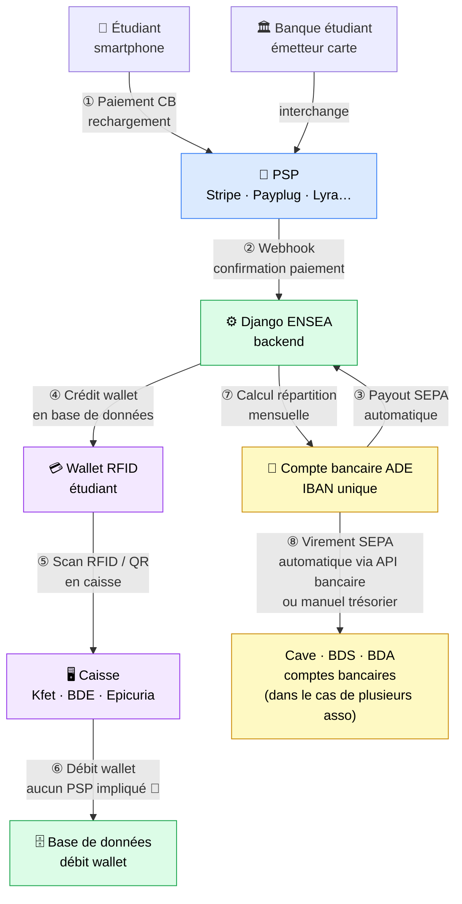

# Glossaire technique & réglementaire
### Termes clés du projet Paiement Dématérialisé RFID ENSEA

> **Auteur :** Maxime RAMBARANE-BARAT - Stage ENSEA 2026
> **À qui s'adresse ce document :** tout membre du projet ou des associations qui croise un terme technique ou réglementaire sans en connaître la définition précise.
> **Voir aussi :** `Analyse_des_solutions_de_paiement_alternative_.md` · `Conformite_reglementaire.md`

---

## Termes techniques

---

### API - Application Programming Interface

**Ce que c'est.** Une API est une interface qui permet à deux logiciels de communiquer entre eux de façon standardisée, sans avoir à connaître leurs détails internes. Concrètement, un logiciel expose une liste de « commandes » que d'autres logiciels peuvent appeler à distance.

**Analogie.** Un serveur dans un restaurant. Tu n'entres pas toi-même en cuisine, tu passes ta commande au serveur, il la transmet, et il te ramène le résultat. Tu ne sais pas comment la cuisine fonctionne, et la cuisine ne sait pas qui tu es. L'API, c'est le serveur.

**Dans notre projet.** Quand un étudiant recharge son wallet depuis son smartphone, notre backend Django envoie une requête à l'API de Stripe (ou Payplug) pour créer un paiement. Stripe répond avec un lien de paiement, l'étudiant paye, puis Stripe notifie Django que le paiement est confirmé. On n'a jamais touché aux serveurs de Stripe, on a juste utilisé leur API.

---

### API REST

**Ce que c'est.** REST (Representational State Transfer) est la façon la plus courante de concevoir une API web. Une API REST utilise les mêmes mécanismes qu'un navigateur qui visite une page web : des requêtes HTTP avec des verbes (`GET` pour lire, `POST` pour créer, `PUT` pour modifier, `DELETE` pour supprimer), des URLs qui identifient les ressources, et des réponses au format JSON.

**Pourquoi c'est important.** Quasiment tous les langages de programmation savent faire des requêtes HTTP. Ça veut dire qu'une API REST est intégrable depuis Django, React, une app mobile ou un script Bash, sans dépendre d'une bibliothèque spécifique au prestataire.

**Dans notre projet.** Stripe et Payplug exposent des API REST. Créer un paiement Stripe depuis Django, c'est envoyer une requête HTTP `POST` vers `https://api.stripe.com/v1/payment_intents` avec les paramètres (montant, devise, etc.) dans le corps. Stripe répond avec un objet JSON décrivant le paiement créé.

```
Django ──POST /v1/payment_intents──▶ Stripe
       ◀── { "id": "pi_xxx", "client_secret": "..." } ──
```

---

### SDK - Software Development Kit

**Ce que c'est.** Un SDK est une boîte à outils fournie par un prestataire pour faciliter l'utilisation de son API dans un langage de programmation donné. Il encapsule les appels HTTP bruts en fonctions de haut niveau, gère l'authentification, la gestion des erreurs, et parfois les types de données.

**Différence avec l'API REST.** L'API REST, c'est le contrat (les URLs, les formats). Le SDK, c'est la facilité : au lieu d'écrire les requêtes HTTP à la main, tu appelles une fonction Python directement.

**Dans notre projet.** Stripe et Payplug ont tous les deux un SDK Python officiel (`stripe` et `payplug`). Sans SDK :

```python
# Appel HTTP brut, authentification manuelle, parsing JSON à la main...
import requests
response = requests.post(
    "https://api.stripe.com/v1/payment_intents",
    auth=("sk_live_xxx", ""),
    data={"amount": 2000, "currency": "eur"}
)
data = response.json()
```

Avec le SDK Stripe :

```python
import stripe
stripe.api_key = "sk_live_xxx"
intent = stripe.PaymentIntent.create(amount=2000, currency="eur")
```

C'est pour ça que l'absence de SDK Python chez Lyra ou Monetico est un inconvénient concret : il faut écrire soi-même l'équivalent de ce que le SDK fait automatiquement.

---

### HMAC - Hash-based Message Authentication Code

**Ce que c'est.** HMAC est un mécanisme cryptographique qui permet de **vérifier qu'un message n'a pas été falsifié** et qu'il provient bien d'un expéditeur connu. Il combine le contenu du message avec une clé secrète partagée pour produire une empreinte numérique (le « code d'authentification »).

**Analogie.** Imagine que tu envoies une lettre cachetée à la cire. Seul quelqu'un qui possède ton cachet peut produire la même empreinte. Si la cire est intacte et correspond au bon motif, le destinataire sait que le message vient bien de toi et n'a pas été ouvert en chemin.

**Pourquoi c'est utilisé dans les paiements.** Monetico utilise HMAC pour sécuriser les échanges entre notre serveur et le leur : quand Monetico notifie notre Django que le paiement est confirmé, il signe le message avec notre clé secrète. Django recalcule la signature et compare, si elles correspondent, le message est authentique. Cela empêche un attaquant de simuler une fausse confirmation de paiement.

**Pourquoi c'est moins confortable que l'API Stripe.** Avec Stripe, la vérification des webhooks est une ligne de code (`stripe.Webhook.construct_event(...)`). Avec Monetico, il faut implémenter soi-même l'algorithme de signature HMAC selon leur documentation propriétaire, faisable, mais plus de code à maintenir.

---

### Webhook

**Ce que c'est.** Un webhook est une notification automatique qu'un service envoie à notre serveur quand un événement se produit de son côté. C'est l'inverse d'une API classique : au lieu que notre serveur aille régulièrement demander « le paiement est-il confirmé ? », c'est Stripe (ou un autre) qui nous prévient dès que quelque chose se passe.

**Dans notre projet.** Scénario typique :
1. L'étudiant est redirigé vers la page de paiement Stripe.
2. Il paye.
3. Stripe envoie un webhook (`POST`) vers notre URL Django : `{ "type": "payment_intent.succeeded", "data": {...} }`.
4. Django reçoit l'événement, vérifie la signature, et crédite le wallet de l'étudiant en base.

Sans webhook, on devrait interroger Stripe toutes les secondes, inefficace et inutilement complexe.

---

### PSP - Prestataire de Services de Paiement

**Ce que c'est.** Un PSP est une entreprise habilitée à traiter des paiements électroniques. Il fait le lien entre l'acheteur (qui paye), sa banque, le réseau carte (Visa, Mastercard, CB), et le vendeur. Il est agréé par les autorités financières (ACPR en France, ou équivalent).

**Les différents rôles dans le paiement par carte :**

| Acteur | Rôle | Exemples |
|--------|------|---------|
| **Émetteur** | Banque du payeur, qui a émis la carte | BNP, Société Générale, Crédit Agricole |
| **Acquéreur** | Banque ou PSP du vendeur, qui reçoit et valide les paiements | Stripe, Payplug, Crédit Mutuel (Monetico) |
| **Réseau carte** | Infrastructure d'interopérabilité entre banques | Visa, Mastercard, CB (Carte Bancaire) |
| **Passerelle** | Interface technique entre le site web et l'acquéreur | PayZen, module Monetico |

Certains PSP cumulent les rôles (Stripe est à la fois passerelle et acquéreur). PayZen de Lyra n'est qu'une passerelle, il faut un contrat acquéreur séparé avec sa banque.

**Dans notre projet.** Stripe, Payplug, Lyra Collect et Monetico sont tous des PSP. Quand on choisit l'un d'eux, on leur confie le traitement des rechargements CB, ils garantissent la conformité PCI-DSS (sécurité des données carte), la lutte anti-fraude, et le reversement des fonds vers notre compte.

---

### Interchange

**Ce que c'est.** L'interchange est la commission perçue par la **banque de l'acheteur** (l'émetteur de la carte) sur chaque transaction. Elle est payée par le commerçant (via son PSP) et représente la majeure partie des frais de transaction.

**Les taux en Europe.** La réglementation européenne plafonne l'interchange pour les cartes consommateurs :
- Cartes de débit : maximum **0,2 %**
- Cartes de crédit : maximum **0,3 %**

Les cartes professionnelles (« business ») ne sont pas plafonnées, c'est pourquoi le taux est beaucoup plus élevé sur ces cartes (2,5 % chez Payplug, par exemple).

**Pourquoi Mr Moubêche en a parlé.** Un PSP français (Lyra, Payplug, Monetico) bénéficie des taux d'interchange européens plafonné sur les cartes françaises de particuliers. Stripe, étant américain, peut répercuter des coûts supplémentaires sur certaines configurations. En pratique, pour des étudiants en France avec des cartes CB classiques, la différence est marginale, mais sur plusieurs centaines de milliers d'euros de volume annuel, quelques dixièmes de point représentent plusieurs milliers d'euros.

---

### Contrat VAD (ou VADS) - Vente À Distance Sécurisée

**Ce que c'est.** Un contrat VAD est un agrément que vous signez avec votre **banque** pour être autorisé à accepter des paiements par carte sur Internet. Historiquement, sans ce contrat, une association ou entreprise ne pouvait pas encaisser en ligne. C'est la banque qui porte le risque acquéreur.

**Pourquoi ça disparaît progressivement.** Des PSP comme Stripe, Payplug et Lyra Collect ont obtenu eux-mêmes l'agrément d'établissement de paiement, ils **remplacent** le contrat VAD bancaire. Vous contractez directement avec eux (KYC), plus avec votre banque. C'est l'une des grandes ruptures des fintechs des années 2010.

**Dans notre projet.** Si on choisit Monetico, il nous faut un contrat VAD avec le Crédit Mutuel ou le CIC, donc obligatoirement un compte bancaire dans ce réseau. Si on choisit Stripe, Payplug ou Lyra Collect, aucun contrat VAD n'est nécessaire.

---

### KYC - Know Your Customer

**Ce que c'est.** Le KYC (« connaître son client ») est l'ensemble des vérifications qu'un PSP ou une banque effectue avant d'activer un compte. Il s'agit d'identifier et de vérifier l'entité qui va encaisser de l'argent, pour prévenir le blanchiment et la fraude.

**Documents typiques demandés pour une association :**
- Statuts de l'association déposés en préfecture
- Récépissé de déclaration (numéro RNA ou parution au Journal Officiel)
- IBAN du compte bancaire de l'association
- Pièce d'identité du représentant légal (président)
- Éventuellement : PV de l'assemblée générale nommant le représentant

**Dans notre projet.** Le KYC est le « formulaire d'inscription » côté administratif chez n'importe quel PSP. Plus il y a de comptes à ouvrir (scénario multi-comptes par asso), plus de KYC à compléter. Le modèle compte mère ramène ça à **un seul KYC** pour l'ADE.

---

### Abonnement SaaS - Software as a Service

**Ce que c'est.** SaaS désigne un logiciel hébergé dans le cloud et accessible via Internet, facturé généralement par abonnement mensuel ou annuel. L'utilisateur ne télécharge rien, n'installe rien, ne gère pas de serveur, il paye pour un service disponible en permanence.

**Dans notre projet.** La plupart des PSP facturent selon deux composantes :
- Un **abonnement mensuel fixe** (coût indépendant du volume, à payer même si personne ne recharge son wallet en août).
- Des **frais par transaction** (coût variable proportionnel au volume).

Stripe ne prend que des frais par transaction, sans abonnement. Payplug a un abonnement selon la formule. C'est ce coût fixe qui peut être problématique pour nous : un mois de vacances scolaires avec peu de transactions coûte pareil qu'un mois plein.

---

## Termes réglementaires

---

### DSP2 - Directive sur les Services de Paiement 2

**Ce que c'est.** La DSP2 (Directive européenne 2015/2366, en vigueur depuis 2018) est la loi européenne qui encadre les services de paiement. Elle a introduit deux grandes obligations :

1. **L'authentification forte (SCA - Strong Customer Authentication)** : pour tout paiement en ligne au-dessus de certains seuils, le payeur doit s'authentifier avec au moins deux facteurs parmi trois (quelque chose qu'il sait : mot de passe ; quelque chose qu'il a : son téléphone ; quelque chose qu'il est : biométrie). En pratique, c'est ce qui déclenche le SMS de confirmation de votre banque quand vous payez en ligne.

2. **L'ouverture des données bancaires** : les banques doivent permettre à des tiers agréés d'accéder aux comptes (avec accord du client), c'est l'open banking.

**Dans notre projet.** Tous les PSP de notre comparatif implémentent DSP2/SCA. Concrètement, quand un étudiant recharge son wallet, la banque peut lui demander de valider via son application bancaire. C'est transparent pour nous côté technique (géré par le PSP), mais c'est une étape supplémentaire dans le parcours utilisateur à prévoir dans le design de l'interface.

---

### PCI-DSS - Payment Card Industry Data Security Standard

**Ce que c'est.** PCI-DSS est un standard de sécurité imposé par les réseaux de cartes (Visa, Mastercard, CB) à quiconque manipule des données de carte bancaire (numéros, CVV, dates d'expiration). La certification PCI-DSS implique des audits de sécurité réguliers et des exigences techniques strictes (chiffrement, journaux d'audit, etc.).

**Ce que ça change pour nous.** Si notre application stockait ou transmettait elle-même les numéros de carte, on devrait être certifiés PCI-DSS, ce qui est hors de portée pour un projet associatif. C'est précisément pourquoi on utilise un PSP : **c'est lui qui manipule les données carte**, nous on n'y touche jamais. L'étudiant saisit son numéro directement sur la page hébergée par Stripe/Payplug, pas sur notre serveur. Notre responsabilité PCI-DSS est ainsi réduite au minimum.

---

### ACPR - Autorité de Contrôle Prudentiel et de Résolution

**Ce que c'est.** L'ACPR est l'autorité française de supervision du secteur bancaire et de l'assurance, adossée à la Banque de France. Elle délivre les agréments aux établissements de paiement et surveille leur conformité.

**Dans notre projet.** C'est l'ACPR qui pourrait, en théorie, exiger un agrément pour notre système de wallet. Notre analyse de conformité conclut que nous entrons dans l'exemption d'agrément de l'article L.525-5 du Code monétaire et financier, mais Mr Moubêche recommande de soumettre notre dossier au **pôle fintech-innovation de l'ACPR** pour confirmation officielle.

---

### Fintech

**Ce que c'est.** Contraction de *financial technology*. Désigne les entreprises qui utilisent la technologie pour proposer des services financiers innovants, souvent en concurrence directe avec les banques traditionnelles. Caractéristiques typiques : onboarding 100 % en ligne, API-first, tarification transparente, pas d'agence physique.

**Dans notre projet.** Stripe, Payplug, Lyra Collect et HelloAsso sont des fintechs. Monetico est à l'opposé : c'est le bras e-commerce d'un groupe bancaire traditionnel. Wero est un hybride : porté par les banques (Crédit Agricole, BNP, BPCE…) mais construit comme une fintech.

---

### Monnaie électronique

**Ce que c'est.** Au sens juridique (Directive européenne DME2 / Code monétaire et financier), la monnaie électronique est une valeur monétaire stockée électroniquement, émise en échange de fonds réels, représentant une créance sur l'émetteur, et acceptée comme moyen de paiement par des tiers.

**Dans notre projet.** Le wallet RFID de l'étudiant est de la monnaie électronique : il dépose 20 € réels → son solde passe à 20 € → ce solde est accepté par la Kfet, le BDE et Epicuria. Émettre de la monnaie électronique requiert un agrément ACPR, **sauf** si toutes les conditions de l'exemption réseau limité sont remplies, ce qui est notre cas (voir `conformite-monnaie-electronique.md`).

---

### Portage des fonds

**Ce que c'est.** Question juridique simple mais cruciale : à qui appartient l'argent pendant qu'il est sur le compte du PSP ou de l'entité mère, entre le moment où l'étudiant recharge et le moment où l'asso est payée ?

**Dans notre projet.** Avec le modèle compte mère :
- L'étudiant paye → l'argent arrive sur le compte PSP de l'ADE → le PSP reverse sur le compte bancaire ADE → le wallet est crédité en base.
- Les soldes non dépensés appartiennent en droit à l'étudiant (il a une créance sur l'ADE). C'est précisément la définition de la monnaie électronique.
- C'est aussi l'une des questions clés listées par Mr Moubêche : *que devient un solde non dépensé après 1 an ? Que se passe-t-il si l'ADE est dissoute ?* Ces réponses doivent figurer dans les CGU.

---

### Payout (ou virement de règlement)

**Ce que c'est.** Le payout est le virement que le PSP effectue depuis son propre compte vers le compte bancaire du vendeur (ici, l'ADE). Le PSP ne garde pas l'argent indéfiniment, il le reverse périodiquement (quotidien, hebdomadaire, mensuel, selon la configuration).

**Dans notre projet.** Avec le modèle compte mère, l'ADE reçoit les payouts de son PSP sur son IBAN unique, puis effectue elle-même les virements SEPA mensuels vers les IBAN de chaque association. Ces virements finaux sont des opérations bancaires classiques, totalement hors PSP.

---

### Interopérabilité

**Ce que c'est.** Capacité de plusieurs systèmes distincts à fonctionner ensemble et à s'échanger des données. Dans le paiement, ça désigne le fait que ma carte BNP peut payer chez un commerçant qui a son compte à la Société Générale, grâce aux réseaux Visa/Mastercard/CB qui font l'interface.

**Dans notre projet.** Wero est une réponse à l'absence d'interopérabilité des systèmes P2P européens actuels (Lydia, Bizum en Espagne, Twint en Suisse…). En créant un réseau paneuropéen, Wero vise à remplacer ces silos.

---

## Résumé visuel du flux de paiement dans notre projet
 

 
Ce schéma illustre le point clé : **le PSP n'est impliqué que pour le rechargement**. Tout le reste (paiement en caisse, répartition entre assos) est géré en interne. C'est pourquoi le choix du PSP n'impacte que la colonne rechargement, et non l'architecture globale.
 
### Automatisation des reversements aux assos
 
Le virement ⑧ peut être automatisé de plusieurs façons selon le niveau de maturité du projet :
 
| Option | Principe | Complexité | Dépendance |
|--------|----------|------------|------------|
| **Manuel (pilote 2026)** | Le trésorier ADE effectue 3 virements SEPA depuis son interface bancaire, à partir du rapport généré par Django | Faible - Django génère un PDF/CSV récapitulatif | Aucune |
| **API bancaire EBICS / open banking** | Django appelle directement l'API de la banque ADE pour émettre les virements SEPA automatiquement | Moyenne - nécessite d'intégrer l'API de la banque (disponibilité selon la banque) | Banque de l'ADE |
| **Stripe Connect** | Django déclenche des `Transfer` API vers les comptes Connect de chaque asso | Élevée - 3 KYC Connect, onboarding par asso | Stripe uniquement |
 
**Recommandation :** pour le pilote 2026, le virement manuel reste raisonnable (3 virements/mois = quelques minutes pour le trésorier). L'automatisation via API bancaire est l'évolution naturelle pour 2027, une fois la banque de l'ADE identifiée. Stripe Connect est à réserver si le besoin de reversement en temps réel devient impératif.
 
---


*Document rédigé par Maxime RAMBARANE-BARAT - Stage ENSEA 2026*  
*Dernière mise à jour : juin 2026*
