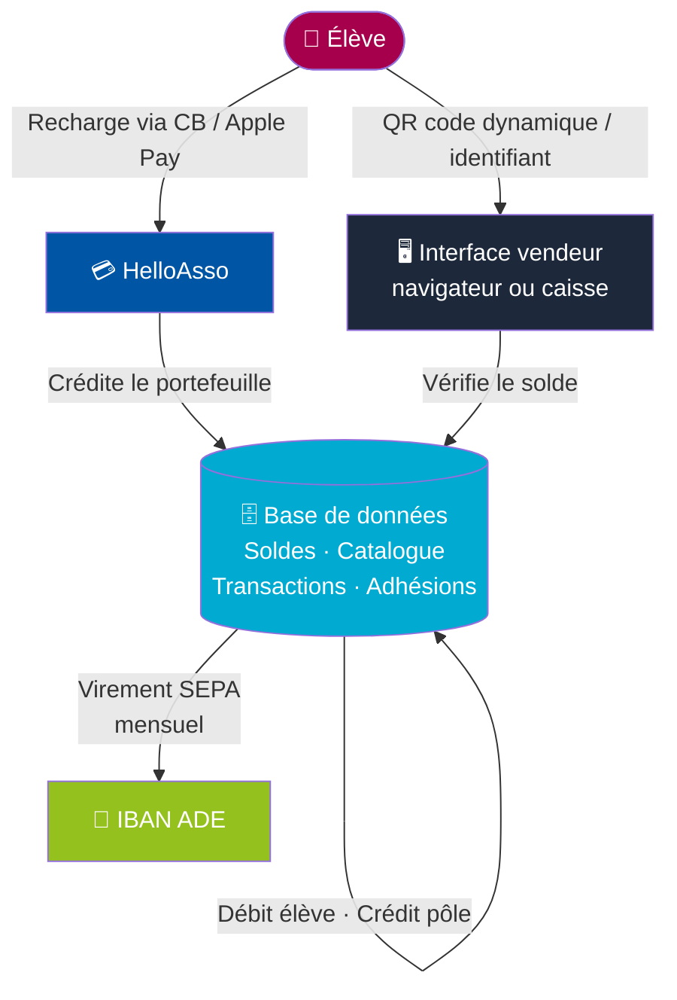
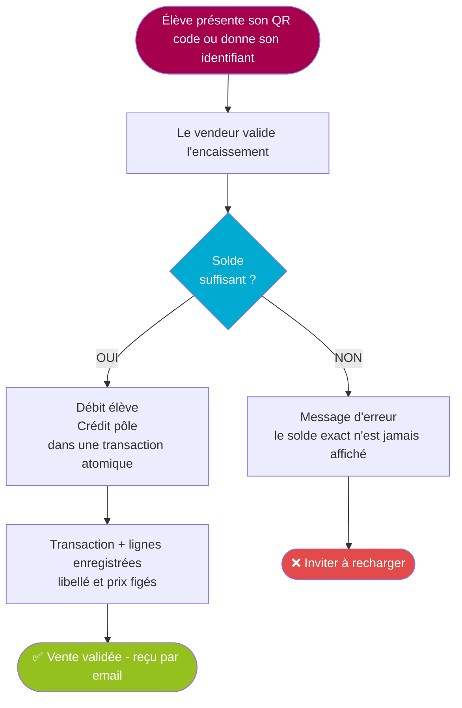
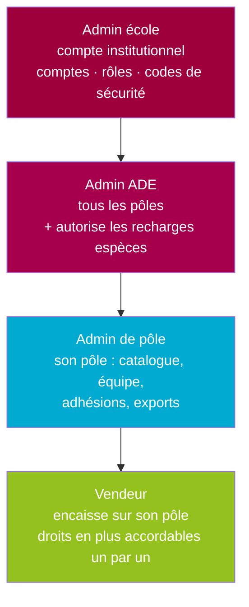
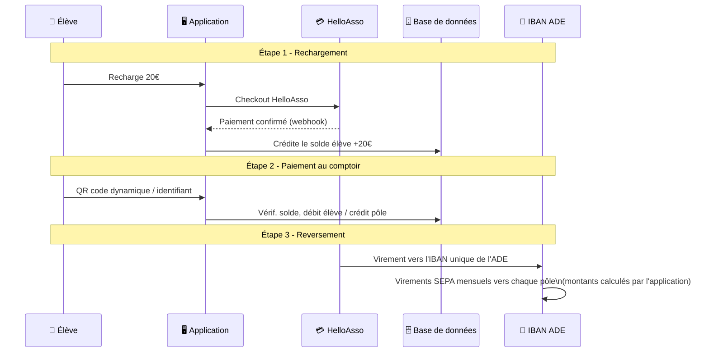

# 2026_Stage_Caisse_Ensea - Plateforme de paiement dématérialisée ENSEA

> Système de paiement cashless pour les associations de l'ENSEA - portefeuille prépayé lié à la carte étudiante (QR code dynamique, carte RFID prévue).

**Statut : Développement en cours - Stage 2026**  
**Auteur : Maxime RAMBARANE-BARAT**  
**Encadrants : Nicolas PAPAZOGLOU et Céline PLASSART**

---

## Sommaire

1. [Contexte et objectifs](#1-contexte-et-objectifs)
2. [Périmètre du projet](#2-périmètre-du-projet)
3. [Architecture générale](#3-architecture-générale)
4. [Fonctionnalités](#4-fonctionnalités)
5. [Architecture des rôles](#5-architecture-des-rôles)
6. [Modèle financier](#6-modèle-financier)
7. [Stack technique](#7-stack-technique)
8. [Matériel](#8-matériel)
9. [Structure du dépôt](#9-structure-du-dépôt)
10. [Pour la personne qui reprend le projet](#10-pour-la-personne-qui-reprend-le-projet)

---

## 1. Contexte et objectifs

### Origine du projet

Ce projet a été initié par un élève de l'ENSEA dans le cadre de l'option Maker, avec pour objectif de créer une caisse enregistreuse numérique pour la Kfet. Il a ensuite été repris par des 1A pour continuer le développement (PCB, interface vendeur, modèles 3D).

Ce stage 2026 vise à aller plus loin : **créer une plateforme de paiement dématérialisée complète**, utilisable par toutes les associations de l'école.

### Problème résolu

Aujourd'hui, les achats dans les associations (café, boissons, sandwichs, cotisations, événements) se font principalement en cash. Cela pose plusieurs problèmes :

- Gestion fastidieuse de la monnaie pour les vendeurs
- Pas de traçabilité des ventes
- Pas de statistiques exploitables pour adapter l'offre
- Risque de perte ou de vol de la caisse
- Pas de continuité entre les promos (pas d'historique)

### Objectif

Permettre aux élèves de payer dans toutes les associations de l'ENSEA avec leur **carte étudiante existante** (ou un QR code sur leur téléphone), après avoir rechargé un portefeuille virtuel. L'argent est reversé sur le compte bancaire de chaque association.

---

## 2. Périmètre du projet

### Structure associative de l'ENSEA

**ADE (Association Des Élèves)** est l'association mère qui regroupe les associations de l'école. Elle chapeaute notamment :

- **BDE** (Bureau Des Étudiants)
- **Kfet** (cafétéria de l'école)
- **Epicuria** (association cuisine étudiante)
- **Foyer** (lieu commun de détente étudiante)

### Associations concernées (V1)

| Association | Rattachement | Priorité |
|---|---|---|
| **ADE** | Asso mère - IBAN central | V1 |
| **BDE** | Sous ADE | V1 |
| **Kfet** | Sous ADE | V1 |
| **Epicuria** | Sous ADE | V1 |
| Autres assos | BDS, BDA (Arèna, Dansea, Pixart)... | V2 |

> Le modèle repose sur le fait que Kfet, BDE et Epicuria sont **statutairement rattachées à l'ADE** : c'est l'ADE qui encaisse pour ses propres pôles, pas une asso qui encaisse pour des tiers. Ce point conditionne la conformité réglementaire (voir [Documents/conformite_reglementaire/](Documents/conformite_reglementaire/)) et doit être formalisé si ce n'est pas déjà le cas.

---

## 3. Architecture générale

### Principe de fonctionnement



### Flux d'un paiement



> Le détail des flux réellement implémentés (vente catalogue, terminal montant libre, QR étudiant, recharge espèces, adhésion, code de sécurité, anonymisation) est dans [Software/Diagramme_BDD/Diagramme_de_flux_explication.md](Software/Diagramme_BDD/Diagramme_de_flux_explication.md).

---

## 4. Fonctionnalités

### Fait

- [x] Portefeuille prépayé par élève, débit/crédit atomique et verrouillé
- [x] Paiement au comptoir par **QR code dynamique** (jeton à usage unique, 120 s) ou identifiant saisi
- [x] Vente catalogue (pôles → catégories / événements → produits) et vente « terminal » à montant libre
- [x] Gestion du catalogue par pôle, stock vérifié à l'encaissement
- [x] Adhésions par pôle et par année scolaire (portefeuille ou espèces), liste des adhérents, anti-double paiement
- [x] Recharge en **espèces** par un admin (traçée : qui encaisse, quel pôle)
- [x] Rôles et droits fins par pôle, **code de sécurité** à 6 chiffres par compte à pouvoir
- [x] Espace admin école : comptes, rôles, codes, recettes agrégées
- [x] Exports Excel (financier anonymisé, participants nominatif, trésorerie)
- [x] Reçus par email, suppression de compte avec délai de 90 jours et anonymisation

### À faire

- [ ] Brancher **HelloAsso** pour de vrai (aujourd'hui : stub, seule la recharge espèces est câblée)
- [ ] Carte **RFID** réellement lue à l'encaissement (le champ `uid_rfid` existe mais n'est pas utilisé)
- [ ] Blocage **réversible** d'un compte ou d'un QR compromis (statut `DESACTIVE` présent dans le schéma, pas câblé), distinct de la suppression définitive
- [ ] Tarif différencié **adhérent / non-adhérent** sur les produits
- [ ] Authentification via le **CAS de l'école** (aujourd'hui : comptes Django)
- [ ] Passage à **PostgreSQL** (aujourd'hui : SQLite)
- [ ] Mise en production : `DEBUG=False`, `SECRET_KEY` hors dépôt, `ALLOWED_HOSTS`, HTTPS (nécessaire pour la caméra hors `localhost`)
- [ ] **Démarche ACPR** : préparer le support de présentation du projet et, si la déclaration d'exemption est décidée, remplir le formulaire (l'ACPR a répondu et détaillé la procédure — voir `Documents/conformite_reglementaire/Conformite_reglementaire.md` §6)
- [ ] Rédiger les **CGU** (aujourd'hui : fichier vide)
- [ ] Tableau de bord statistique, notifications push, V2 des PCB

---

## 5. Architecture des rôles

Le modèle réel est **`Affectation(user, pôle, rôle, droits…)`** : une personne peut cumuler
plusieurs affectations (plusieurs rôles, sur des pôles différents).



| Rôle | Portée | Peut faire |
|---|---|---|
| **Admin école** | global | Créer/corriger les comptes, attribuer les rôles, générer les codes de sécurité. Ne voit que des **recettes agrégées** |
| **Admin ADE** | global (tous les pôles) | Tout gérer sur tous les pôles, autoriser un vendeur à recharger en espèces |
| **Admin de pôle** | un pôle | Catalogue, événements, équipe, adhésions, exports de son pôle |
| **Vendeur** | un pôle | Encaisser (catalogue ou montant libre). Droits supplémentaires accordables un par un : gérer les produits, adhésions, adhésion espèces, voir l'équipe, exporter, paramètres |

- **Code de sécurité** : un code à 6 chiffres propre à `(personne, pôle)`, haché comme un mot de passe, remis en main propre par un admin école, exigé une fois par session pour tout compte détenant un rôle.
- **Garde-fous serveur** : un vendeur ne peut jamais modifier les droits de l'équipe ; on ne peut pas retirer le dernier admin école.

### Passage de promo

L'admin école est **institutionnel**, lié à l'école, pas à une personne. Quand les bureaux changent, l'admin école met à jour les identifiants des nouveaux admins d'assos. Rien d'autre ne change.

---

## 6. Modèle financier

### Flux de rechargement et de paiement



### Modèle « compte unique ADE »

Tout l'argent arrive sur **un seul compte** (celui de l'ADE). La répartition par pôle est
tenue dans la base de données ; chaque mois, le trésorier de l'ADE fait les virements SEPA
vers les pôles à partir du récapitulatif généré par l'application. Pas besoin de multi-comptes
(type Stripe Connect) : un compte standard suffit, et on peut changer de prestataire sans
toucher à l'architecture.

### Qui paie les frais ?

**HelloAsso ne prend aucune commission** (0 % pour l'association). Le service se finance par
un **pourboire volontaire** proposé au payeur sur la page de paiement, modifiable et pouvant
être mis à 0 €. C'est le point à expliquer clairement dans l'appli pour éviter
l'incompréhension « on m'a prélevé plus que ma recharge ».

Stripe (≈ 1,5 % + 0,25 €) et les solutions bancaires restent documentés en plan B - voir
[Documents/Systèmes de paiment/](Documents/Systèmes%20de%20paiment/) pour le comparatif chiffré.

### Limites de rechargement (à intégrer aux CGU)

| Paramètre | Valeur | Raison |
|---|---|---|
| Rechargement minimum | 10 € | Confort d'usage, cohérence avec les CGU |
| Rechargement maximum | 30 € | Reste très en dessous du plafond légal (250 € - exemption L.525-5) |
| Solde maximum | 100 € | Limite l'exposition en cas de problème |

> ⚠️ Ces plafonds ne sont **pas encore implémentés dans le code**. À faire avant toute mise en production (code monétaire et financier).

### Gestion du solde en fin d'année

Le remboursement retenu se fait par **virement bancaire manuel du trésorier ADE**(Avec la fédération ce sera le trésorier de la fédération) :

1. **Solde conservé** d'une année à l'autre (recommandé pour la V1)
2. **Remboursement sur demande** avant une date limite
3. **Don automatique** à une asso désignée si solde non réclamé

Cas particulier à gérer : un élève qui **redouble ou reste plus longtemps** ne doit pas perdre son solde à la fin de la 3ᵉ année (prévoir une date de fin de scolarité, pas un simple compteur d'années).

---

## 7. Stack technique

| Élément | Choix |
|---|---|
| Backend | **Django** (auth, rôles, templates), une seule app `caisse` - CAS de l'école prévu plus tard |
| Base de données | **SQLite** en développement, **PostgreSQL** prévu en production |
| Frontend | Templates Django + Bootstrap ; scan QR par la **caméra du navigateur** (jsQR), aucun lecteur matériel dédié dans l'app |
| Paiement en ligne | **HelloAsso Checkout** (0 % commission, compte unique ADE). Stripe documenté en plan B |
| Emails | Reçus + codes ; bascule automatique console / SMTP selon la config |
| Exports | `openpyxl` (Excel), téléchargement direct |
| Matériel | 2 PCB Raspberry Pi (Pi 5 pour la caisse, Pi Zero 2 W pour le terminal) - voir [Hardware/](Hardware/) |

### Sécurité des données

- **IBAN des assos** : à chiffrer en base, accessibles uniquement par l'admin école
- **Données bancaires des élèves** : jamais stockées sur notre infrastructure (gérées par le prestataire, certifié PCI-DSS)
- **Carte RFID** : ne contient qu'un **identifiant**, aucune donnée personnelle ni financière
- **Code de sécurité** : haché, jamais relisible en clair
- **Suppression de compte** : jamais de suppression physique - anonymisation après 90 jours, l'historique comptable reste lisible (obligation de conservation des pièces comptables)

---

## 8. Matériel

| Composant | État | Notes |
|---|---|---|
| Raspberry Pi Zero 2 W (terminal) | ✅ Disponible | Attention au modèle exact : un Pi Zero W **v1** (ARMv6) est incompatible 64-bit |
| Raspberry Pi 5 (caisse) | ✅ Disponible | |
| Écran tactile, RC522 (RFID), OLED SSD1327 | ✅ Disponibles | |
| Lecteur QR code | ⚠️ À revoir | Le module disponible n'est pas compatible UART (voir `Hardware/PROBLEMES_MATERIEL.md`) |
| HAT UPS Geekworm X306 + batterie 18650 | ✅ Disponible | |
| **PCB v1 (les 2 cartes)** | ⚠️ Conçus et soudés, **défauts** | Empreinte MOSFET erronée, interrupteur mal placé, R12… → **V2 nécessaire** |
| Modèle 3D caisse / module | ✅ Réalisés | Liens OnShape ci-dessous |
| Interface vendeur (site web) | ✅ Remplacée | Le projet actuel réécrit tout en Django |

Détail complet de la conception, des défauts et des corrections V2 : [Hardware/README.md](Hardware/README.md).

### Liens OnShape

- Caisse : https://cad.onshape.com/documents/130fb2b6551d2083bdc09601/w/de445baa7e8a743f2d08bd5c/e/c2924dab3bdb2ac69360e5d6
- Module de paiement : https://cad.onshape.com/documents/4dc830a0412bba7f47b33ed8/w/8311454ded09dd50ffee2863/e/942e29f2a726fc97f9c5b10e

### Repo précédent

https://github.com/DBXYD/2526_Projet1AB_Khess

---

## 9. Structure du dépôt

```
2026_Stage_Caisse_Ensea/
├── README.md                 ← ce fichier
│
├── Documents/                ← tout le travail d'étude et de cadrage
│   ├── conformite_reglementaire/   ← monnaie électronique, exemption ACPR, glossaire
│   ├── Systèmes de paiment/         ← business models chiffrés, benchmark autres écoles
│   └── Réunion/                     ← comptes rendus (Moubêche, ECAM, Monecarte, GLYPS…)
│
├── Hardware/                 ← conception électronique des 2 PCB
│   ├── README.md
│   ├── PROBLEMES_MATERIEL.md        ← retour d'expérience + corrections V2
│   ├── PCB_Caisse_Enregistreuse/    ← KiCad, Gerber, datasheets, doc
│   └── PCB_Caisse_Dématérialisée/   ← idem, pour le terminal portable
│
├── Software/                 ← l'application et sa documentation
│   ├── README.md
│   ├── Raspberry/                   ← mise en service + tests des 2 cartes
│   ├── Diagramme_BDD/               ← architecture réelle, schéma BDD, flux, machines à états
│   ├── Tutoriel_Application_Cashless_ENSEA/  ← le code Django réel + tuto pas à pas
│   ├── First_Test_Appli_Django/    ← premier essai (historique)
│   └── Ancienne_réflexion/          ← conception initiale, non retenue (historique)
│
└── Images/                   ← illustrations des documents
```

---

## 10. Pour la personne qui reprend le projet

### Par où commencer

| Je veux… | Aller dans… |
|---|---|
| Comprendre le code qui tourne | [Software/README.md](Software/README.md) puis [Software/Diagramme_BDD/](Software/Diagramme_BDD/) |
| Refaire un Raspberry Pi de zéro | [Software/Raspberry/RaspberryPi_Tuto.md](Software/Raspberry/RaspberryPi_Tuto.md) |
| Refaire les PCB (V2) | [Hardware/README.md](Hardware/README.md) puis `PROBLEMES_MATERIEL.md` |
| Connaître le cadre légal | [Documents/conformite_reglementaire/](Documents/conformite_reglementaire/) |
| Choisir / justifier le prestataire de paiement | [Documents/Systèmes de paiment/](Documents/Systèmes%20de%20paiment/) |
| Voir ce que font les autres écoles | `Documents/Systèmes de paiment/Benchmark_Systemese_de_paiement_étudiants_existants.md` |
| Retrouver l'historique des décisions | [Documents/Réunion/](Documents/Réunion/) |

### Ce qu'il faut absolument savoir

1. **L'admin école** est un compte institutionnel lié à l'école : ne jamais le supprimer, juste changer le mot de passe en début d'année.
2. **On ne supprime jamais un compte** : l'anonymisation vide les champs personnels et coupe l'accès, mais garde la ligne pour que l'historique comptable (ventes, recharges, adhésions) reste lisible.
3. **L'argent est toujours un `Decimal`**, jamais un `float`. Toute écriture de solde passe par une transaction atomique verrouillée, avec revérification juste avant l'écriture.
4. **Une ligne de vente fige le libellé et le prix** au moment de l'achat : l'historique ne bouge pas si le produit change ou disparaît.
5. **Le modèle « compte unique ADE »** suppose que les pôles sont statutairement sous l'ADE. Si ce n'est pas formalisé, c'est le chantier le plus important avant tout déploiement (plus que n'importe quel choix technique).
6. **HelloAsso n'est pas encore branché** : le code contient un stub, seule la recharge en espèces fonctionne réellement aujourd'hui.

### Attention aux documents « historiques »

`Software/Ancienne_réflexion/` et `Software/First_Test_Appli_Django/` décrivent des pistes
**abandonnées** (SSO, mode hors-ligne, terminal matériel piloté par API, cryptomonnaie interne…).
Ils sont gardés pour la trace, mais **ne décrivent pas le code actuel**. La référence à jour,
c'est `Software/Diagramme_BDD/`.

---

## Licence

Projet interne ENSEA - usage restreint aux associations de l'école.

---

*Dernière mise à jour : août 2026 - Maxime RAMBARANE-BARAT*
