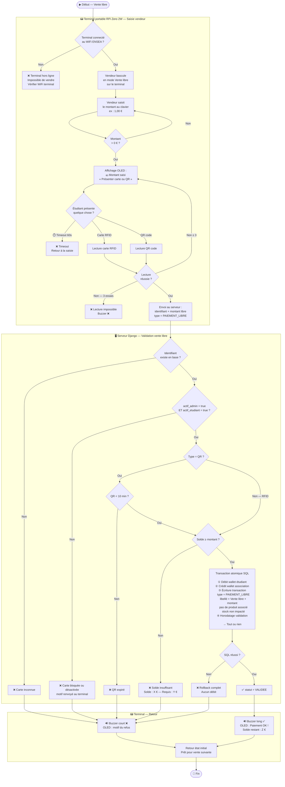
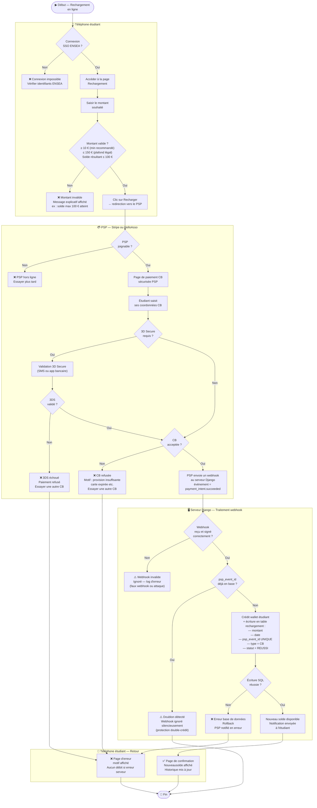
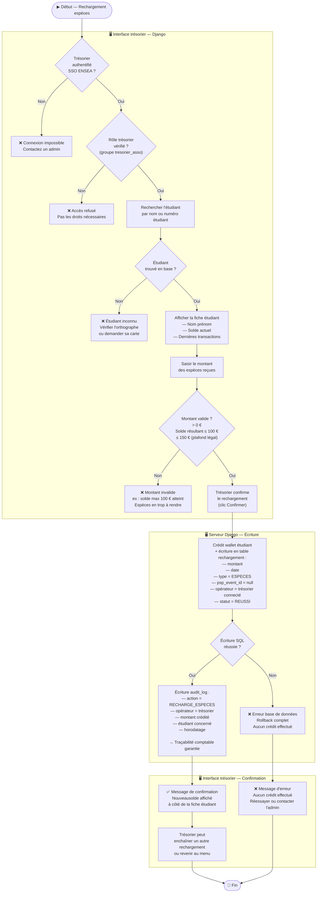

# Flowcharts - Système de paiement dématérialisé ENSEA (ancienne version, avec terminal matériel)

> Archive de la version précédente de ce document, conservée telle quelle
> pour mémoire. Elle décrivait une cible avec un terminal matériel dédié
> (Raspberry Pi, lecteur RFID, écran OLED, buzzer), qui n'a **pas** été
> implémentée dans l'application actuelle (voir `Diagramme_de_flux_explication.md`
> pour l'état réel du code). Peut servir de point de départ si cette direction
> matérielle est reprise plus tard.
>
> **Acteurs**
> - 📱 **Interface vendeur** : téléphone du vendeur (ou Raspberry Pi 5 en poste fixe)
> - 📟 **Terminal portable** : Raspberry Pi Zero 2W (écran OLED + lecteur RFID + lecteur QR)
> - 🖥️ **Serveur Django** : hébergé sur le réseau ENSEA (intranet uniquement)
> - 💳 **PSP** : Stripe ou HelloAsso, à titre d'exemple 
>
> ⚠️ **Contrainte réseau** : le serveur Django est hébergé en local ENSEA.
> Le terminal portable doit être connecté au WiFi ENSEA (ou un réseau avec accès à ce serveur).
> Hors réseau ENSEA (événement extérieur, hotspot mobile), le terminal **ne peut pas joindre le serveur**.

---

## Flux 1 — Vente catalogue

> Le vendeur sélectionne les produits depuis son interface, le montant s'affiche sur le terminal,
> l'étudiant présente sa carte RFID ou son QR code.

```mermaid
flowchart TD

    START([▶ Début — Vente catalogue])
    START --> W1

    subgraph VENDEUR["📱 Interface vendeur — téléphone ou RPi 5"]
        W1{"WiFi ENSEA\nconnecté ?"}
        W1 -->|Non| W1E["❌ Pas de réseau\nImpossible de vendre\nVérifier le WiFi ENSEA"]
        W1 -->|Oui| AUTH{"Vendeur connecté\nSSO ENSEA ?"}
        AUTH -->|Non| LOGIN["Se connecter\nSSO ENSEA"]
        LOGIN --> AUTH2{"Authentification\nréussie ?"}
        AUTH2 -->|Non| AUTH2E["❌ Identifiants invalides\nContactez l'admin"]
        AUTH2 -->|Oui| SEL
        AUTH -->|Oui| SEL["Sélectionner les produits\ndans le catalogue\nex : 2 cafés, 1 sandwich"]
        SEL --> EMPTY{"Panier\nnon vide ?"}
        EMPTY -->|Non| SEL
        EMPTY -->|Oui| VALID["✅ Valider le panier\n→ envoi au serveur"]
    end

    subgraph SRV_CREATE["🖥️ Serveur Django - Création de la transaction"]
        VALID --> PING{"Serveur Django\njoignable ?"}
        PING -->|Non| PING_E["❌ Serveur hors ligne\nVérifier le réseau ENSEA"]
        PING -->|Oui| STOCK{"Stock suffisant\npour chaque article ?"}
        STOCK -->|Non| STOCK_E["❌ Stock insuffisant\nMessage au vendeur\nAjuster le panier"]
        STOCK -->|Oui| CREATE["Créer transaction en base\nstatut = EN_ATTENTE\nhorodatage = maintenant"]
        CREATE --> PUSH["Envoyer le montant\nau terminal portable"]
    end

    subgraph TERM_WAIT["📟 Terminal portable RPi Zero 2W — Attente paiement"]
        PUSH --> TERM_UP{"Terminal\nconnecté WiFi ?"}
        TERM_UP -->|Non| TERM_E["❌ Terminal hors ligne\nVérifier WiFi du terminal\nRedémarrer si nécessaire"]
        TERM_UP -->|Oui| OLED["Affichage OLED :\n💶 Montant total\n« Présenter carte ou QR »"]
        OLED --> WAIT{"Étudiant présente\nquelque chose ?"}
        WAIT -->|"⏱️ Timeout 60s"| TIMEOUT["❌ Timeout\nstatut = ANNULEE\nOLED : Transaction expirée\nTerminal réinitialisé"]
        WAIT -->|"Carte RFID"| RFID["Lecture carte RFID\n(SPI — RC522)"]
        WAIT -->|"QR code"| QR["Lecture QR code\n(UART)"]
        RFID --> READ{"Lecture\nréussie ?"}
        QR --> READ
        READ -->|"Non — essai ≤ 3"| OLED
        READ -->|"Non — 3 essais épuisés"| READ_E["❌ Lecture impossible\nBuzzer ❌ court\nOLED : Réessayer\nou changer de moyen"]
        READ -->|Oui| SEND["Envoi au serveur :\nidentifiant + type RFID ou QR"]
    end

    subgraph SRV_CHECK["🖥️ Serveur Django — Validation"]
        SEND --> ID_OK{"Identifiant\nexiste en base ?"}
        ID_OK -->|Non| ID_E["❌ Carte inconnue\nNon enregistrée dans le système"]
        ID_OK -->|Oui| ADM{"actif_admin\n= true ?"}
        ADM -->|Non| ADM_E["❌ Carte bloquée\npar l'administration\nContacter un admin"]
        ADM -->|Oui| ETU{"actif_etudiant\n= true ?"}
        ETU -->|Non| ETU_E["❌ Carte désactivée\npar l'étudiant lui-même\nRéactiver dans l'app"]
        ETU -->|Oui| QR_TYPE{"Type = QR code ?"}
        QR_TYPE -->|Oui| QR_AGE{"QR émis\nil y a moins de 10 min ?"}
        QR_AGE -->|Non| QR_E["❌ QR expiré\nDemander un nouveau QR\ndepuis l'application"]
        QR_AGE -->|Oui| SOLDE
        QR_TYPE -->|"Non — RFID"| SOLDE{"Solde étudiant\n≥ montant à payer ?"}
        SOLDE -->|Non| SOLDE_E["❌ Solde insuffisant\nSolde actuel : X €\nMontant requis : Y €\nRecharger le compte"]
        SOLDE -->|Oui| ATOMIC["Transaction atomique SQL\n\n① Débit wallet étudiant\n② Crédit wallet association\n③ Écriture en table transaction\n④ Copie libellé + prix à l'instant t\n⑤ Écriture ligne_transaction\n⑥ Décrément stock produit\n⑦ Horodatage validation\n\n→ Tout ou rien"]
        ATOMIC --> DB_OK{"Toutes les\nécritures SQL\nréussies ?"}
        DB_OK -->|Non| DB_E["❌ Erreur base de données\nRollback complet automatique\nAucun débit effectué\nstatut = ECHEC"]
        DB_OK -->|Oui| VALID2["✅ statut = VALIDEE\nRéponse OK envoyée\nau terminal"]
    end

    subgraph TERM_RESP["📟 Terminal portable — Retour visuel et sonore"]
        VALID2 --> BUZ_OK["🔊 Buzzer long ✅\nOLED : Paiement OK !\nSolde restant : Z €"]
        ID_E --> FAIL
        ADM_E --> FAIL
        ETU_E --> FAIL
        QR_E --> FAIL
        SOLDE_E --> FAIL
        DB_E --> FAIL
        FAIL["🔊 Buzzer court ❌\nOLED : motif du refus"]
        BUZ_OK --> RESET["Terminal revient à l'état initial\nPrêt pour le paiement suivant"]
        FAIL --> RESET
    end

    RESET --> END1([🔴 Fin])
```

---

## Flux 2 — Vente libre

> Le vendeur saisit directement un montant sur le terminal (produit hors catalogue).
> L'étudiant présente sa carte RFID ou son QR code.

---

## Flux 3 — Rechargement en ligne (CB via Stripe ou HelloAsso)

> L'étudiant recharge son wallet depuis son téléphone en payant par carte bancaire.

---

## Flux 4 — Rechargement en espèces (via trésorier)

> L'étudiant apporte des espèces à un trésorier,
> qui crédite manuellement le wallet depuis l'interface Django.

---

## Récapitulatif des contraintes critiques

| Contrainte | Flux concerné | Comportement si non respectée |
|---|---|---|
| WiFi ENSEA requis | Tous | Blocage dès le début, message explicite |
| Serveur Django local ENSEA | Tous | Hors réseau ENSEA = terminal injoignable |
| `actif_admin = true` | Paiement 1 et 2 | Refus carte, message « bloquée par admin » |
| `actif_etudiant = true` | Paiement 1 et 2 | Refus carte, message « désactivée par étudiant » |
| QR code valide < 10 min | Paiement 1 et 2 | Refus, demande nouveau QR |
| Solde ≥ montant | Paiement 1 et 2 | Refus, solde affiché |
| Transaction atomique SQL | Paiement 1 et 2 | Rollback complet si erreur — aucun débit partiel |
| Montant recharge ≤ 150 € | Rechargement 3 et 4 | Bloqué côté Django (plafond légal CMF D.525-1) |
| Solde résultant ≤ 100 € | Rechargement 3 et 4 | Bloqué côté Django |
| `psp_event_id` unique | Rechargement 3 | Webhook doublon ignoré silencieusement |
| Timeout terminal 60s | Paiement 1 et 2 | Transaction annulée, terminal réinitialisé |
| 3 essais lecture max | Paiement 1 et 2 | Buzzer ❌, affichage erreur |
