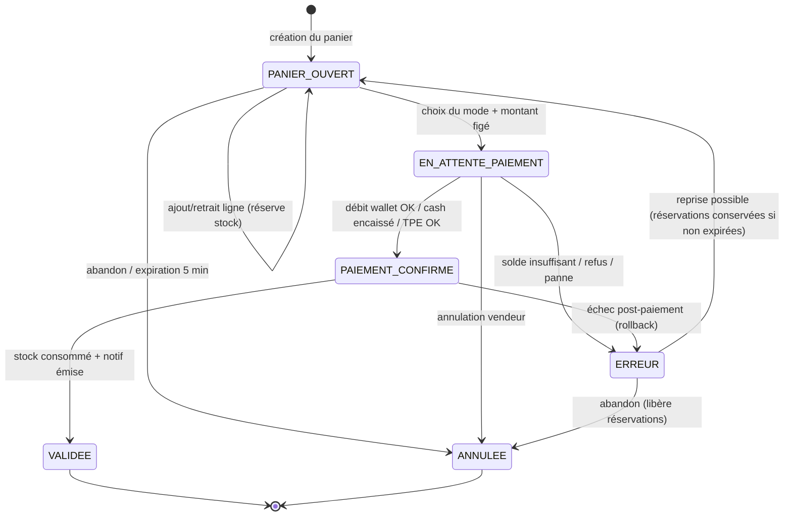
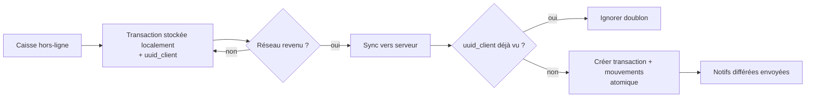

# Machine à états — Transaction de paiement

Source de vérité du cycle de vie d'une vente. Diagramme rendu directement sur GitHub
(Mermaid) ou collable sur https://mermaid.live.

## Description des états

| État | Sens | Effets de bord | Sorties |
|---|---|---|---|
| **PANIER_OUVERT** | lignes en cours d'ajout | réserve le stock (expire à 5 min) | EN_ATTENTE_PAIEMENT, ANNULEE |
| **EN_ATTENTE_PAIEMENT** | mode choisi, montant figé | aucun débit encore | PAIEMENT_CONFIRME, ERREUR, ANNULEE |
| **PAIEMENT_CONFIRME** | l'argent est pris | débit wallet **atomique** / cash / TPE | VALIDEE, ERREUR |
| **VALIDEE** | terminal, vente actée | stock consommé, notif, ligne comptable asso | — |
| **ERREUR** | échec récupérable | rien de monétaire engagé (ou rollback) | PANIER_OUVERT, ANNULEE |
| **ANNULEE** | terminal, abandon | libère toutes les réservations | — |

## Invariants à garantir

1. **Atomicité** : le passage `EN_ATTENTE_PAIEMENT → PAIEMENT_CONFIRME → VALIDEE` qui touche
   le wallet et le compte asso se fait dans **une seule** `transaction.atomic()` avec
   `select_for_update` sur le wallet. Jamais « débité mais pas validé ».
2. **Idempotence** : `uuid_client` unique → rejouer une sync hors-ligne ne crée pas de doublon.
3. **Réservation bornée** : un panier non payé en 5 min → `ANNULEE`, stock libéré
   automatiquement.
4. **Pas de solde négatif silencieux** : hors-ligne, le wallet n'est débité que si l'asso
   l'autorise, avec plafond ; sinon mode espèces/TPE.
5. **Historique stable** : à `VALIDEE`, on a déjà copié `libelle` + `prix_applique` dans
   `LigneTransaction` (indépendant du catalogue courant).

## Flux hors-ligne (résumé)

