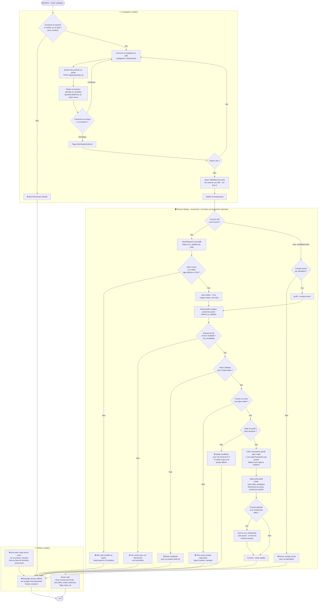
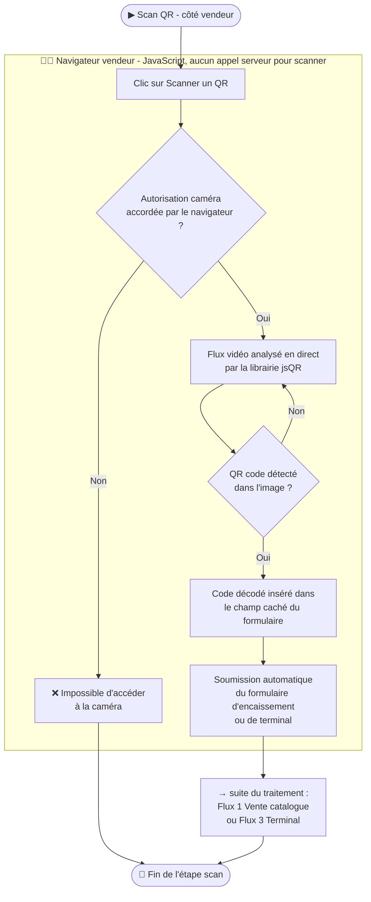
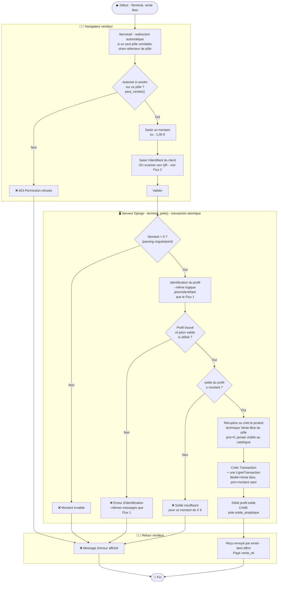
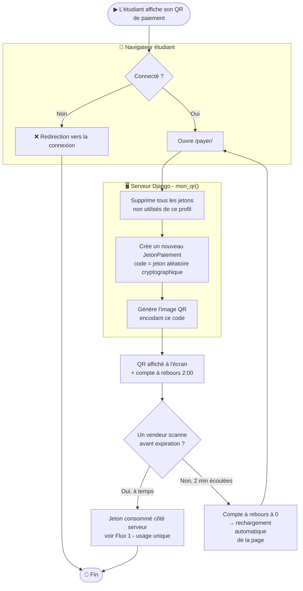
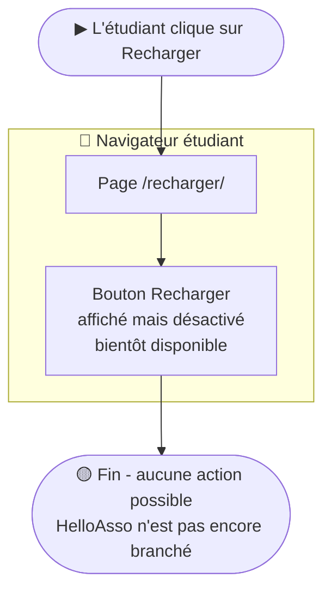
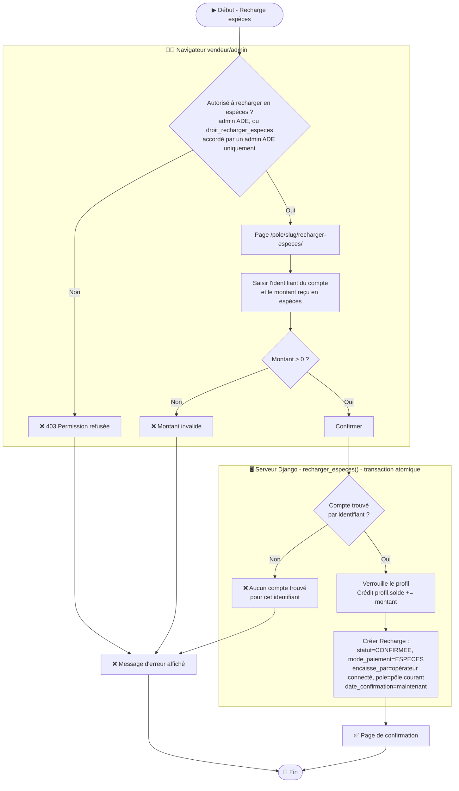
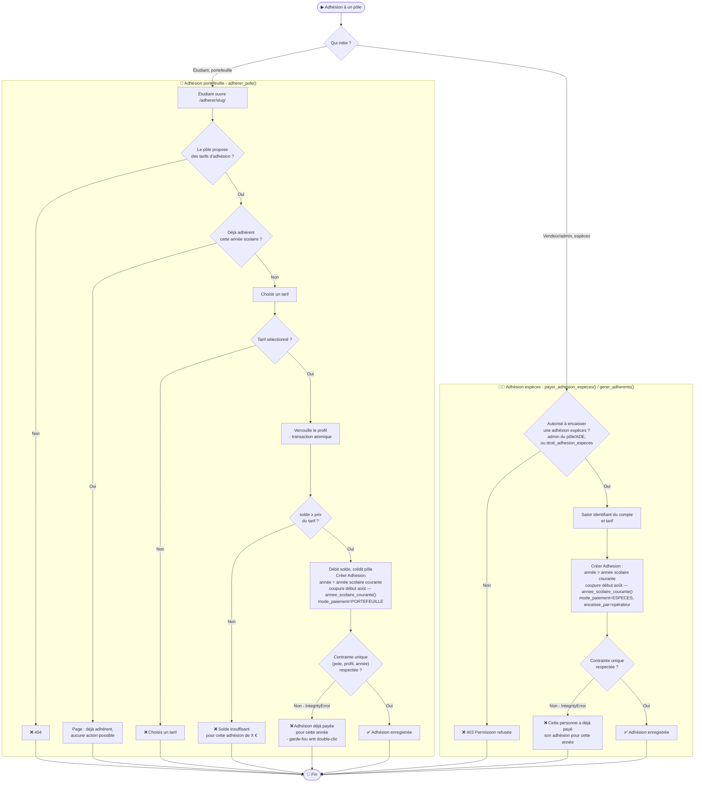
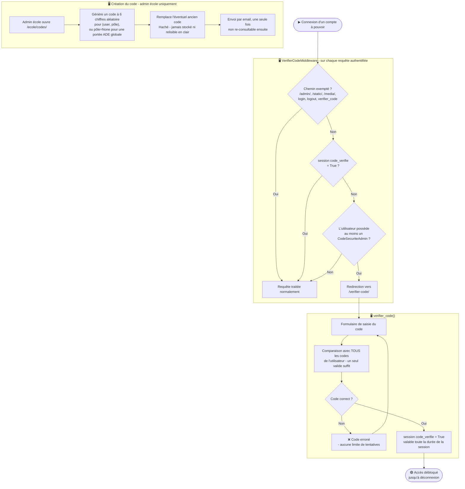
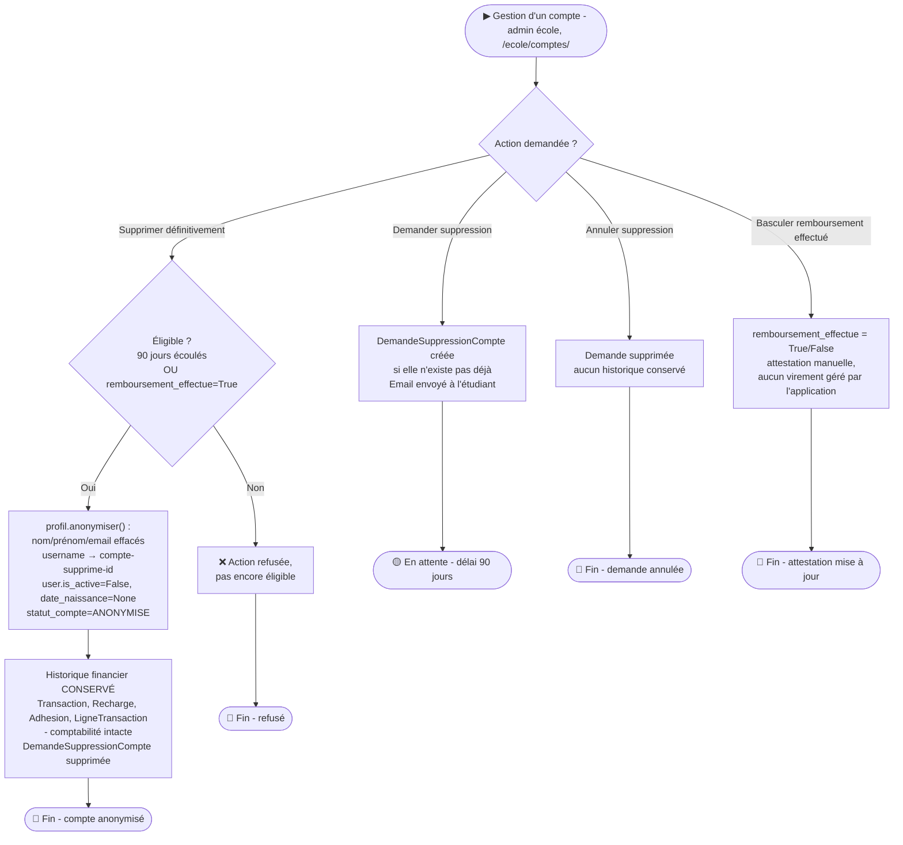

# Flowcharts - Système de paiement dématérialisé ENSEA

> **Acteurs**
> - 📱 **Navigateur étudiant** : le téléphone (ou ordinateur) de l'étudiant
> - 🧑‍💼 **Navigateur vendeur/admin** : le téléphone, la tablette ou le poste de caisse du vendeur/admin, dans le même navigateur web
> - 🖥️ **Serveur Django** : seul composant serveur, tout y transite
> - 💳 **HelloAsso** : PSP prévu pour les recharges en ligne, **pas encore branché** (voir Flux 5)
>
> Généré à partir du code réel de `caisse/models.py`, `caisse/views.py`,
> `caisse/vues_ecole.py`, `caisse/roles.py`, `caisse/middleware.py` et
> `caisse/helloasso.py` (état du projet au 25/08/2026).

---

## Flux 1 - Vente catalogue et encaissement

> Le vendeur constitue un panier depuis le catalogue du pôle (stocké en session,
> pas en base tant que la vente n'est pas validée), puis encaisse : soit
> l'acheteur présente son QR code (Flux 2), soit le vendeur saisit son
> identifiant à la main.

---

## Flux 2 - Scan QR côté vendeur

> Il n'y a **aucun lecteur RFID ni terminal matériel** : le scan se fait par la
> caméra du navigateur du vendeur, en JavaScript pur, sans aller-retour serveur
> pour la lecture elle-même.

---

## Flux 3 - Terminal (vente hors catalogue, montant libre)

> Malgré son nom, le « Terminal » n'est pas un boîtier physique : c'est une page
> Django pour encaisser un montant libre, sans passer par le catalogue
> (pourboire, article non référencé...).

---

## Flux 4 - QR de paiement dynamique côté étudiant

> Un jeton à usage unique, régénéré à chaque affichage de page, expire au bout
> de **2 minutes**.

---

## Flux 5 - Recharge en ligne (HelloAsso) - **non implémenté**

> ⚠️ **Cette fonctionnalité n'existe pas encore dans le
> code**. C'est ce que montre le flux réel actuel :

Ce qui existe déjà en préparation, mais n'est pas encore relié :
- Le modèle `Recharge` a des champs `statut` (`EN_ATTENTE` / `CONFIRMEE` /
  `ECHOUEE`), `reference_helloasso`, `mode_paiement="HELLOASSO"`, prêts à être
  utilisés, mais rien dans le code ne les écrit encore.
- `caisse/helloasso.py` ne contient que `inscrire_sur_helloasso()`, utilisée
  uniquement pour synchroniser des billets vendus au catalogue (Flux 1), pas
  pour des paiements. C'est un stub qui ne fait rien et n'échoue jamais.
- Il n'existe **aucune route de webhook** dans `caisse/urls.py`, ni de champ
  d'identifiant d'événement PSP pour empêcher un double crédit (pas de
  `psp_event_id` en base).

---

## Flux 6 - Recharge en espèces

> ⚠️ **Point d'attention** : Il n'y a pas de plafonds par recharge et de solde max, il faudra y penser au titre du code monétaire et financier)
>, ni ici ni pour l'adhésion en espèces (Flux 7). Seul un montant
> strictement positif est exigé. À garder en tête si cette conformité doit être
> assurée avant mise en production.

---

## Flux 7 - Adhésion à un pôle

> Deux chemins bien distincts : l'étudiant paie lui-même par portefeuille, ou
> un vendeur/admin encaisse des espèces à sa place. Les deux écrivent dans le
> même champ `Adhesion.annee`, avec la même contrainte d'unicité `(pole,
> profil, annee)`, il est donc essentiel qu'ils utilisent la même notion
> d'« année ».

> Les deux chemins utilisent la même fonction `annee_scolaire_courante()`
> (coupure début août) pour calculer l'année d'adhésion : une adhésion payée
> par portefeuille ou en espèces le même jour tombe donc toujours dans la
> même case, et la contrainte d'unicité `(pole, profil, annee)` détecte bien
> un doublon quel que soit le mode de paiement utilisé.

---

## Flux 8 - Sécurité des comptes à pouvoir (code de sécurité)

> La « deuxième serrure » : un code à 6 chiffres, propre à chaque `(personne,
> pôle)`, exigé une fois par session pour toute personne détenant au moins un
> rôle protégé par un code.

---

## Flux 9 - Suppression (anonymisation) de compte

---

## Récapitulatif des contraintes réellement appliquées dans le code

| Contrainte | Flux concerné | Comportement si non respectée |
|---|---|---|
| `peut_vendre` / `peut_gerer` / droits `droit_*` | Tous les flux de vente et gestion | 403 Permission refusée |
| Jeton QR valide (< 120 s, non utilisé) | Flux 1, 2, 3 | « QR code invalide ou expiré » |
| Événement `est_vendable()` | Flux 1 | « Les ventes pour cet événement sont terminées » |
| Stock suffisant | Flux 1 | « Stock insuffisant » |
| `solde ≥ montant` | Flux 1, 3, 7 (portefeuille) | « Solde insuffisant », montant exact du solde jamais révélé |
| Transaction atomique + verrous SQL (`select_for_update`) | Flux 1, 3, 6, 7 | Rollback complet si erreur, aucun débit partiel |
| Contrainte unique `(pole, profil, annee)` | Flux 7 | « Adhésion déjà payée pour cette année » |
| `droit_recharger_especes` réservé à l'admin ADE, non délégable par un admin de pôle | Flux 6 | 403 Permission refusée |
| Code de sécurité requis pour tout rôle protégé | Flux 8 | Blocage total de la navigation tant que non validé |
| Délai de 90 jours (ou remboursement attesté) avant anonymisation définitive | Flux 9 | Action refusée avant échéance |
| ~~Plafond de recharge / solde max~~ | Flux 6, 7 | **Non implémenté actuellement** |
| ~~Recharge en ligne via HelloAsso~~ | Flux 5 | **Non implémenté actuellement** - page avec bouton désactivé uniquement |
