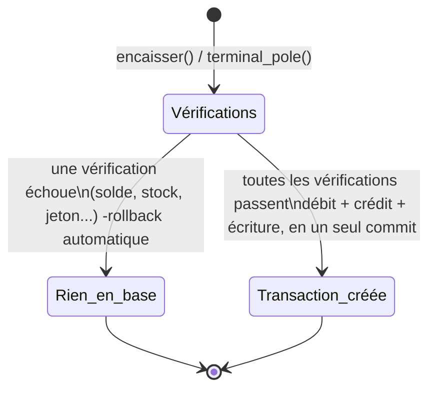
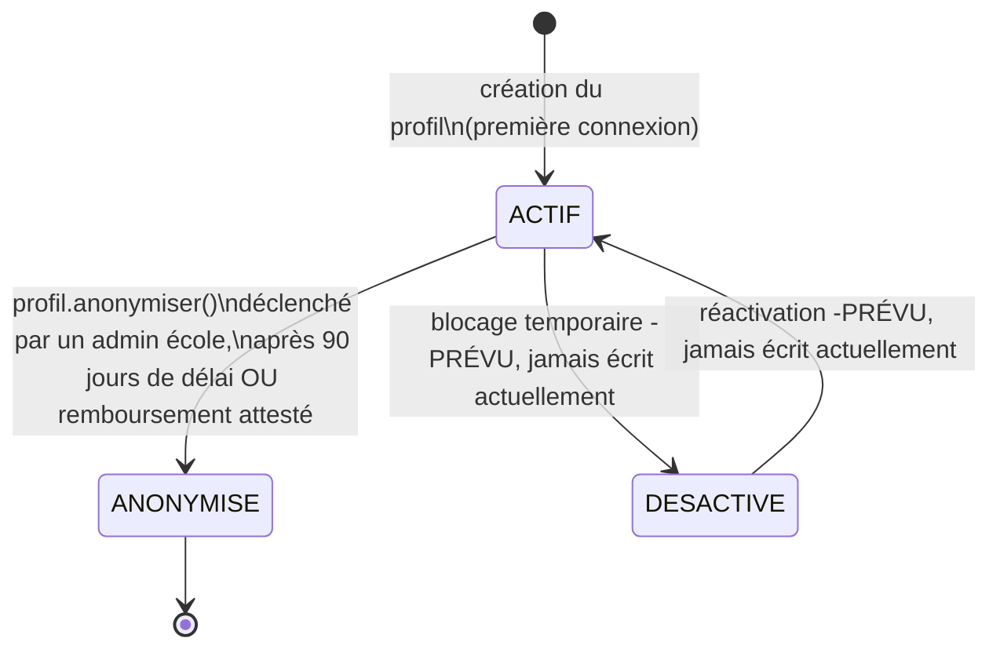
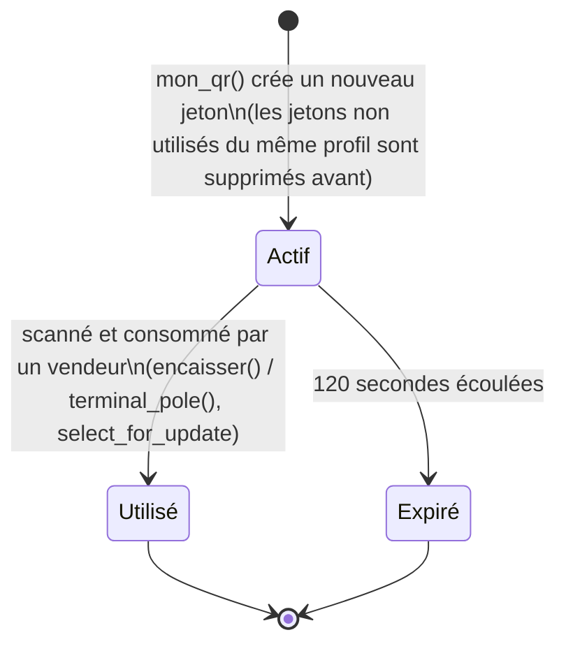
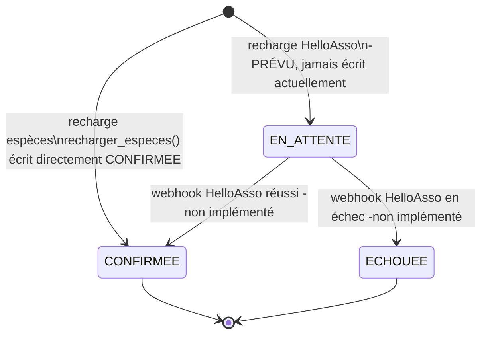
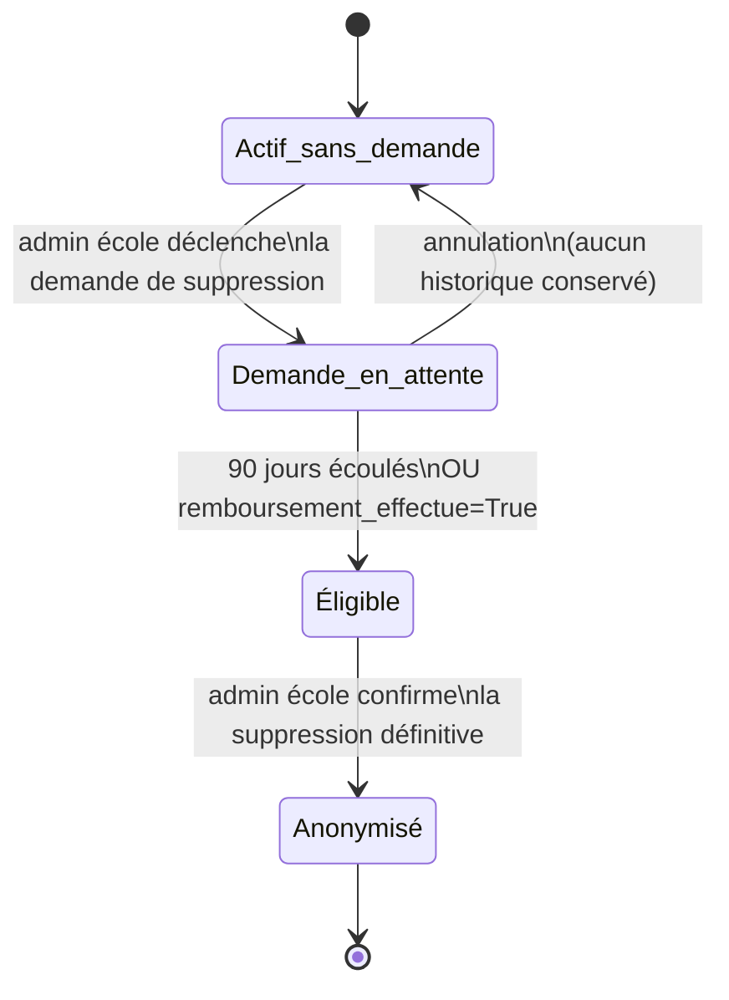

# Machines à états - ENSEA Cashless

> Seuls les modèles qui ont un **vrai** cycle
> de vie à plusieurs états sont couverts ici. Certains champs existent dans le
> schéma sans être réellement utilisés (voir notes ⚠️ sous chaque diagramme) :
> ils sont indiqués tels quels plutôt qu'omis, pour ne pas cacher un futur
> chantier.

---

## Pourquoi il n'y a pas de machine à états pour la vente (`Transaction`)

Le modèle `Transaction` n'a **aucun champ `statut`**. Une vente n'existe en
base que dans un seul état : le résultat d'un bloc `transaction.atomic()`
exécuté en une fois (voir `Diagramme_de_flux_explication.md`, Flux 1 et 3).

Il n'y a donc que deux issues, jamais d'état intermédiaire persistant : soit
la vente n'a jamais existé, soit elle existe et est déjà complète (argent
déplacé, stock décrémenté, ligne créée). Rien à modéliser de plus fin.

---

## 1. Compte étudiant -`ProfilUtilisateur.statut_compte`

- `ACTIF → ANONYMISE` est **unique et irréversible** : une fois `ANONYMISE`,
  rien dans le code ne revient à `ACTIF`.
- ⚠️ Le troisième état, `DESACTIVE`, existe dans le schéma mais **aucun code
  ne l'écrit ni ne le lit** actuellement. Contrairement à `ANONYMISE`
  (suppression définitive, irréversible), l'usage prévu pour `DESACTIVE` est
  un **blocage temporaire et réversible** : en cas de fuite de données
  (identifiants ou QR compromis), l'étudiant lui-même ou un admin école
  pourrait couper l'accès au compte (connexion, paiement par QR) sans en
  effacer l'historique ni les informations, puis le réactiver une fois le
  risque levé, à la différence de la suppression de compte (Partie 9 du
  tutoriel), qui reste définitive après le délai. Reste à câbler : les deux
  vues de bascule, la vérification de ce statut à la connexion et à
  l'encaissement, et la protection contre l'auto-blocage total (un admin
  école dernier titulaire ne devrait pas pouvoir se désactiver lui-même,
  même logique que pour `ADMIN_ECOLE` en Partie 10.1 du tutoriel).

---

## 2. Jeton de paiement QR -`JetonPaiement`

- Pas de champ « expiré » en base : c'est un calcul à la volée
  (`est_valide()`, basé sur `date_creation` comparée à `timezone.now()`),
  refait à chaque tentative d'encaissement, jamais stocké.
- `Utilisé` est en revanche un vrai champ (`utilise=True`), pour empêcher
  qu'un jeton déjà scanné (capture d'écran) soit rejoué.

---

## 3. Rechargement -`Recharge.statut`

- ⚠️ Aujourd'hui, la **seule** transition réellement empruntée par le code
  est `[*] → CONFIRMEE` par le chemin espèces, en une seule écriture directe
  (rien ne passe jamais par `EN_ATTENTE`). `EN_ATTENTE` et `ECHOUEE` existent
  dans le schéma pour la future recharge en ligne HelloAsso (voir Flux 5 du
  document de flux), mais restent inatteignables tant qu'elle n'est pas
  implémentée.

---

## 4. Suppression de compte -`DemandeSuppressionCompte`

> Ce n'est pas un champ `statut` unique, mais la combinaison « la demande
> existe-t-elle ? » + le booléen `remboursement_effectue`. Traité ici comme
> un état dérivé du compte, en complément du diagramme n°1.

- Les deux conditions d'éligibilité (`délai` et `remboursement`) sont des
  **alternatives**, pas cumulatives : l'une ou l'autre suffit à débloquer la
  suppression définitive.
- Une fois `Anonymisé`, rejoint l'état terminal du diagramme n°1
  (`ProfilUtilisateur.statut_compte = ANONYMISE`), les deux machines
  convergent au même endroit.

---

## Récapitulatif

| Modèle / champ | États réellement atteignables aujourd'hui | États définis mais inatteignables |
|---|---|---|
| `ProfilUtilisateur.statut_compte` | ACTIF, ANONYMISE | DESACTIVE |
| `JetonPaiement` (calculé) | Actif, Utilisé, Expiré | -|
| `Recharge.statut` | CONFIRMEE (espèces uniquement) | EN_ATTENTE, ECHOUEE |
| `DemandeSuppressionCompte` (dérivé) | tous les états du diagramme n°4 | -|
| `Transaction` | pas de champ statut -tout ou rien | -|
