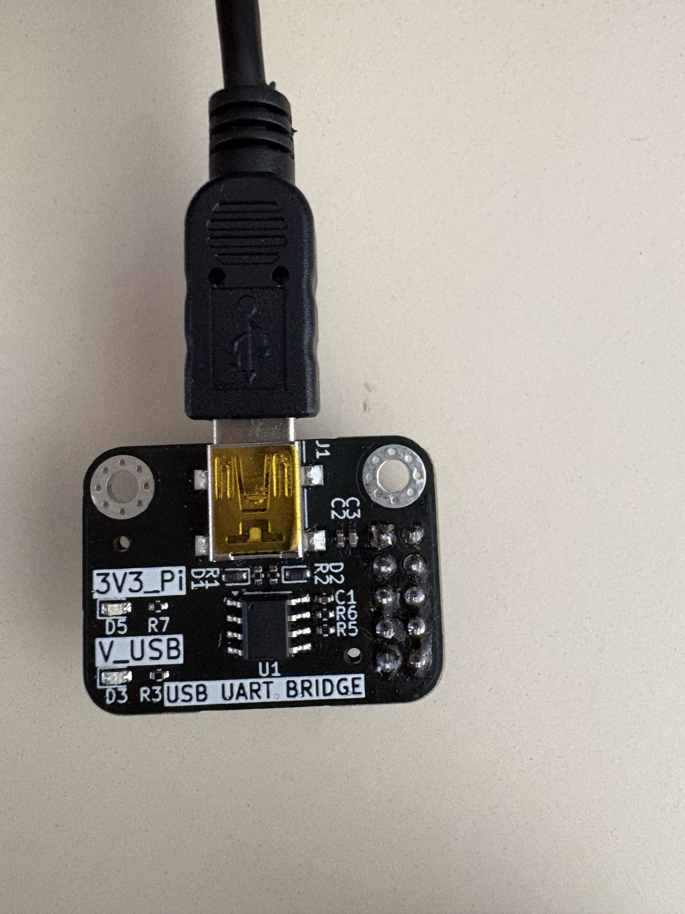
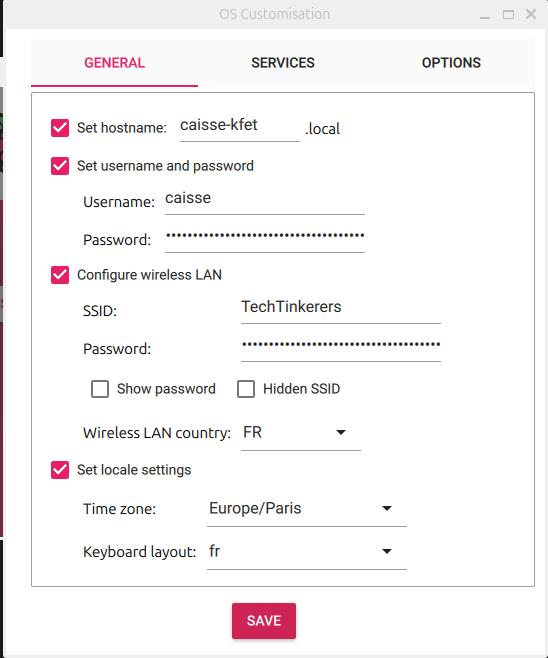
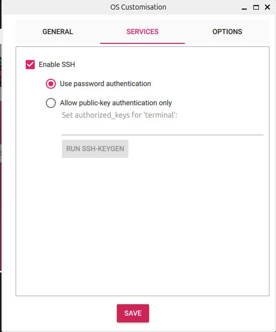
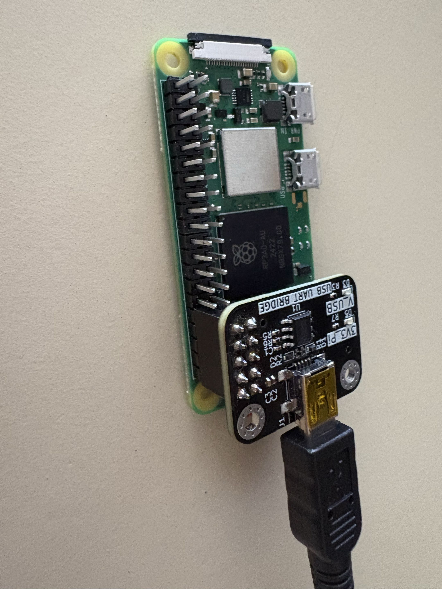

# Guide de mise en service des Raspberry Pi - Projet Caisse ENSEA

> Ce document explique **pas à pas** comment
> repartir de zéro avec les deux Raspberry Pi du système : la **caisse** (Pi 5) et le
> **terminal** (Pi Zero 2 W). Il rassemble aussi tous les pièges rencontrés pendant le stage
> et comment s'en sortir, pour t'éviter de perdre les heures que j'y ai passées.
>
> Prends le temps de lire l'encadré « Pièges » à la fin : chaque point correspond à un vrai
> blocage vécu.

## Sommaire

1. [Ce qu'il te faut avant de commencer](#1-ce-quil-te-faut)
2. [Comprendre les deux Raspberry](#2-comprendre-les-deux-raspberry)
3. [Étape A - Flasher la carte SD](#3-étape-a--flasher-la-carte-sd)
4. [Étape B - Vérifier que la personnalisation a bien été appliquée](#4-étape-b--vérifier-la-personnalisation)
5. [Étape C - Trouver le Raspberry sur le réseau](#5-étape-c--trouver-le-raspberry-sur-le-réseau)
6. [Étape D - Se connecter en SSH](#6-étape-d--se-connecter-en-ssh)
7. [Étape E - La solution de secours : la console série (CH340)](#7-étape-e--la-console-série-ch340)
8. [Étape F - Configurer le WiFi et les interfaces](#8-étape-f--configurer-le-wifi-et-les-interfaces)
9. [Étape G - Installer l'environnement Python](#9-étape-g--installer-lenvironnement-python)
10. [Récapitulatif des pièges rencontrés](#10-récapitulatif-des-pièges)
11. [Aide-mémoire des commandes](#11-aide-mémoire-des-commandes)

---

## 1. Ce qu'il te faut

**Matériel :**
- Le Raspberry à configurer (Pi 5 pour la caisse, ou Pi Zero 2 W pour le terminal)
- Une carte microSD (16 Go minimum) + un lecteur de carte pour ton ordinateur
- Une alimentation adaptée (le Pi 5 tire beaucoup, ne le sous-alimente pas)
- **Un adaptateur USB-UART CH340** (indispensable, voir plus bas pourquoi)

> 
>
> C'est ce petit module qui permet de brancher le Raspberry directement à ton ordinateur
> par un câble, et de voir ce qui se passe au démarrage même quand le WiFi ne marche pas.
> **C'est l'outil qui débloque 90 % des galères.** Ne commence pas sans lui.

**Logiciel sur ton ordinateur :**
- **Raspberry Pi Imager** (raspberrypi.com/software) pour flasher la carte
- `nmap` pour trouver le Raspberry sur le réseau (`sudo apt install nmap`)
- `minicom` pour la console série (`sudo apt install minicom`)

---

## 2. Comprendre les deux Raspberry

Le système utilise deux Raspberry différents, avec deux configurations différentes. **Ne les confonds pas**, c'est une source d'erreurs.

| | **Terminal** | **Caisse** |
|---|---|---|
| Modèle | Raspberry Pi **Zero 2 W** | Raspberry Pi **5** |
| OS | Raspberry Pi OS **Lite** 64-bit | Raspberry Pi OS 64-bit (avec bureau) |
| Hostname conseillé | `terminal-kfet` | `caisse-kfet` |
| Rôle | Lit les cartes RFID, affiche l'OLED, scanne les QR | Interface vendeur en plein écran + tiroir-caisse |
| Interfaces à activer | SPI + I2C + UART | GPIO (tiroir, buzzer) |

> ⚠️ **Attention au modèle exact.** Le Pi **Zero W** (v1) et le Pi **Zero 2 W** se ressemblent
> physiquement mais sont incompatibles : le Zero W v1 est en ARMv6 et **ne peut pas** faire
> tourner une image 64-bit. Vérifie la sérigraphie sur la carte : elle doit dire
> « Raspberry Pi Zero 2 W ». Si tu flashes une image 64-bit sur un Zero W v1, il bootera
> mais ne se comportera jamais comme prévu (voir Pièges).

---

## 3. Étape A - Flasher la carte SD

1. Insère la carte microSD dans ton ordinateur et lance **Raspberry Pi Imager**.
2. **Choose Device** : sélectionne le bon modèle (Raspberry Pi Zero 2 W ou Raspberry Pi 5).
3. **Choose OS** :
   - Terminal → *Raspberry Pi OS (other)* → **Raspberry Pi OS Lite (64-bit)**
   - Caisse → **Raspberry Pi OS (64-bit)** (avec bureau, nécessaire pour le mode kiosque)
4. **Choose Storage** : sélectionne ta carte microSD (vérifie bien que c'est la bonne, tout sera effacé).
5. **Avant de cliquer sur Write**, clique sur **Edit Settings** pour ouvrir la personnalisation.

> 

Dans l'onglet **GENERAL**, remplis :
- **Hostname** : `terminal-kfet` (ou `caisse-kfet`)
- **Username** et **Password** : choisis-les et **note-les précieusement**
- **Configure wireless LAN** : le nom du WiFi (SSID) et son mot de passe
  - ⚠️ Le Pi Zero 2 W et le Pi 5 gèrent le WiFi **2,4 GHz**. Assure-toi que le réseau que tu renseignes est bien en 2,4 GHz.
- **Wireless LAN country** : `FR`
- **Locale settings** : `Europe/Paris`, clavier `fr`

Dans l'onglet **SERVICES** :
- Coche **Enable SSH** → **Use password authentication**

> 

6. Clique sur **SAVE**, puis sur **WRITE**.

> 🚨 **LE PIÈGE LE PLUS IMPORTANT DE TOUT CE GUIDE**
> Après avoir cliqué sur **Write**, l'Imager affiche une fenêtre :
> *« Would you like to apply OS customisation settings? »*
> **Il FAUT cliquer sur « YES ».**
> Si tu cliques « NO » (ou si tu valides trop vite), la carte est écrite **vierge** :
> aucun utilisateur n'est créé, le hostname reste `raspberrypi`, et **aucun identifiant ne
> fonctionnera**. C'est exactement ce qui m'a fait perdre le plus de temps.

7. Attends le message **« Write Successful »**.

---

## 4. Étape B - Vérifier la personnalisation

Ne saute pas cette étape : elle prend 10 secondes et t'évite de découvrir le problème après
avoir tout remonté.

Après le flash, retire puis réinsère la carte dans ton ordinateur (elle se remonte toute
seule, la partition s'appelle `bootfs`). Puis :

```bash
ls /media/$USER/bootfs/firstrun.sh
```

- **Le fichier existe** → la personnalisation est appliquée, c'est bon. ✅
- **« No such file or directory »** → la personnalisation n'a **pas** été appliquée. Reflashe en cliquant bien « YES » cette fois.

### Solution de secours : créer le compte à la main

Si `firstrun.sh` n'apparaît pas et que tu ne veux pas reflasher, tu peux créer le compte
directement sur la carte, **pendant qu'elle est encore branchée sur ton ordinateur** (pas
sur le Raspberry).

1. Génère un mot de passe chiffré (remplace `MonMotDePasse` par le tien, garde les guillemets) :

```bash
echo 'MonMotDePasse' | openssl passwd -6 -stdin
```

Ça affiche une longue chaîne qui commence par `$6$...` : c'est le **hash** (ton mot de passe transformé en empreinte illisible que le système sait vérifier).

2. Crée le fichier `userconf.txt` dans `/media/$USER/bootfs/` (la partition de la carte,
   remontée automatiquement sur ton ordinateur, voir Étape B ci-dessus). Utilise le format
   `utilisateur:hash` (garde les guillemets simples, sinon les `$` sont mal interprétés) :

```bash
echo 'terminal:$6$COLLE_TON_HASH_ICI' | sudo tee /media/$USER/bootfs/userconf.txt
```

3. Active SSH :

```bash
sudo touch /media/$USER/bootfs/ssh
```

4. Vérifie, éjecte proprement, et boote :

```bash
cat /media/$USER/bootfs/userconf.txt   # doit afficher terminal:$6$... en entier
sync
udisksctl unmount -b /dev/sdb1         # adapte /dev/sdb1 si besoin (voir `lsblk`)
```

> ⚠️ **`Error unmounting ... target is busy`** : un programme a encore un fichier ouvert sur
> la carte, le plus souvent une fenêtre du gestionnaire de fichiers (Nautilus) restée ouverte
> sur `bootfs`. Trouve le coupable avec `fuser -vm /media/$USER/bootfs`, ferme la fenêtre en
> question (ou tue tous les Nautilus avec `nautilus -q`), puis relance `sync` et
> `udisksctl unmount -b /dev/sdb1`.

---

## 5. Étape C - Trouver le Raspberry sur le réseau

Insère la carte dans le Raspberry, branche l'alimentation, et **attends 2 à 3 minutes**
(le premier démarrage est plus long, il redimensionne la partition).

Sur beaucoup de réseaux, la commande simple avec le nom ne marche pas :

```bash
ssh terminal@terminal-kfet.local
# ssh: Could not resolve hostname terminal-kfet.local
```

C'est normal (le `.local` / mDNS ne passe pas partout). On cherche alors l'**adresse IP**
directement avec `nmap`, qui scanne le réseau et liste les appareils avec le port SSH ouvert :

```bash
sudo nmap -p 22 192.168.0.0/24
```

> ℹ️ Adapte `192.168.0.0/24` à ton réseau. Pour connaître ton réseau, tape `ip route` : la
> ligne `default via 192.168.X.1` te donne les trois premiers nombres.

Dans la liste, repère les lignes des Raspberry. **Les Raspberry Pi ont une adresse MAC qui
commence souvent par `B8:27:EB`, `DC:A6:32`, `D8:3A:DD`, `2C:CF:67` ou `BC:24:11`.**

```
Nmap scan report for 192.168.0.246
Host is up (0.0011s latency).
PORT   STATE SERVICE
22/tcp open  ssh
MAC Address: 2C:CF:67:EF:A2:05 (Unknown)   ← probablement ton Raspberry
```

> 💡 **Astuce** : fais un scan **avant** d'allumer le Raspberry, puis un **après**. La nouvelle
> adresse qui apparaît est la sienne. C'est le moyen le plus fiable de l'identifier quand
> plusieurs Raspberry sont sur le réseau.

Si **aucune** nouvelle adresse n'apparaît après plusieurs minutes, le Raspberry n'a pas réussi
à se connecter au WiFi. Passe directement à l'**Étape E (console série)** pour comprendre
pourquoi : c'est le seul moyen de voir ce qui se passe.

---

## 6. Étape D - Se connecter en SSH

Une fois l'IP trouvée :

```bash
ssh terminal@192.168.0.246
```

- À la première connexion, il demande de confirmer la clé : tape `yes`.
- Entre le mot de passe défini dans l'Imager.

Tu es connecté quand tu vois un prompt du type `terminal@raspberrypi:~ $`.

Première commande, mettre à jour le système :

```bash
sudo apt update && sudo apt full-upgrade -y
```

> Si tu vois une erreur `dpkg was interrupted`, corrige avec :
> ```bash
> sudo dpkg --configure -a
> ```
> puis relance la commande.

---

## 7. Étape E - La console série (CH340)

**C'est la technique qui sauve quand rien d'autre ne marche.** Quand le Raspberry ne veut pas
se connecter au WiFi, tu ne peux pas savoir pourquoi… sauf en le branchant directement à ton
ordinateur par un câble série. Là, tu vois **tous les messages de démarrage** en direct.

### Le branchement

L'adaptateur CH340 se connecte sur trois broches GPIO du Raspberry. **Croise bien TX et RX**
(le TX de l'un va sur le RX de l'autre) :

| Fil du CH340 | Broche du Raspberry (numéro physique) |
|---|---|
| **GND** | Pin 6 (GND) |
| **TX** | Pin 10 (GPIO15 / RXD) |
| **RX** | Pin 8 (GPIO14 / TXD) |

> ⚠️ **Ne branche PAS le fil 5V du CH340** si le Raspberry est déjà alimenté par ailleurs
> (batterie, secteur). Tu risquerais un conflit d'alimentation. On utilise seulement GND, TX, RX.

> 
>
> Sur la photo, on voit bien comment cela est branché.

Il faut aussi que la console série soit activée sur la carte. Si tu pars d'une **carte neuve**,
ajoute cette ligne dans le fichier `config.txt` de la partition `bootfs` (depuis ton ordi,
avant de booter) :

```ini
enable_uart=1
```

### Ouvrir la console

Branche le CH340 à ton ordinateur en USB, puis vérifie qu'il est détecté :

```bash
lsusb
# doit lister : QinHeng Electronics CH340 serial converter
ls /dev/ttyUSB*
# doit afficher : /dev/ttyUSB0
```

Ouvre la console (vitesse **115200 bauds**) :

```bash
minicom -D /dev/ttyUSB0 -b 115200
```

> Si tu vois `Device /dev/ttyUSB0 is locked`, un minicom précédent traîne encore :
> ```bash
> pkill minicom
> sudo rm -f /var/lock/LCK..ttyUSB0
> ```

Tu verras défiler les logs de démarrage. Laisse-le finir, tu arriveras à un prompt
`raspberrypi login:`. Connecte-toi avec ton utilisateur et ton mot de passe.

> **Pour quitter minicom proprement** : `Ctrl+A` puis `X`. (Ne ferme pas juste la fenêtre,
> sinon le port reste verrouillé.)

### Ce que la console t'apprend

- La ligne `Machine model: Raspberry Pi ...` te confirme **le vrai modèle** de la carte.
- Si le prompt affiche `raspberrypi` au lieu de ton hostname → la personnalisation n'a pas été appliquée (retour Étape B).
- Le message `Wi-Fi is currently blocked by rfkill. Use raspi-config to set the country before use.` signifie que le WiFi est bloqué tant que le pays n'est pas défini (voir Étape F).
- `My IP address is 127.0.1.1` (au lieu d'une adresse `192.168.x.x`) signifie que le Raspberry n'est **pas connecté au réseau**.

---

## 8. Étape F - Configurer le WiFi et les interfaces

Une fois connecté (par SSH ou par la console série), lance l'outil de configuration :

```bash
sudo raspi-config
```

### WiFi (si pas déjà fait dans l'Imager)

1. **Localisation Options → WLAN Country → FR** - indispensable, débloque le WiFi (`rfkill`).
2. **System Options → Wireless LAN** → entre le SSID (réseau **2,4 GHz**) et le mot de passe.

Vérifie que la connexion est établie :

```bash
ip a
```

Cherche, sous `wlan0`, une ligne `inet 192.168.x.x` : c'est ton IP. Si tu la vois, le WiFi
marche, tu peux passer en SSH.

> ⚠️ Cette IP est attribuée automatiquement (DHCP) et **peut changer à chaque redémarrage**.
> Pour un appareil en service permanent, il faudra lui fixer une IP (réservation DHCP côté box,
> ou IP statique). À prévoir avant l'installation définitive.

### Interfaces (spécifique au TERMINAL)

Le terminal a besoin de SPI (lecteur RFID), I2C (écran OLED) et UART (lecteur QR).

Dans `raspi-config` → **Interface Options** :
- **SPI** → Yes
- **I2C** → Yes
- **Serial Port** :
  - *login shell over serial?* → **NO**
  - *serial port hardware?* → **YES**

Puis édite `/boot/firmware/config.txt` :

```bash
sudo nano /boot/firmware/config.txt
```

Ajoute à la fin :

```ini
# --- Terminal Caisse ENSEA ---
dtparam=spi=on
dtparam=i2c_arm=on
dtoverlay=disable-bt
gpio=18=op,dh
```

> `dtoverlay=disable-bt` libère le « vrai » port série (PL011, plus stable) pour le lecteur QR,
> en désactivant le Bluetooth qui l'occupait. Après ça, `/dev/serial0` doit pointer vers
> `ttyAMA0` (et non `ttyS0`).

Redémarre :

```bash
sudo reboot
```

Après redémarrage, vérifie que tout est là :

```bash
ls /dev/spidev*     # attendu : /dev/spidev0.0 et /dev/spidev0.1
i2cdetect -y 1      # doit lister les adresses des composants branchés
ls -l /dev/serial0  # doit pointer vers ttyAMA0
```

> 🐛 **Piège I2C** : si `i2cdetect` répond `Could not open file /dev/i2c-1`, le module noyau
> n'est pas chargé. Corrige :
> ```bash
> sudo modprobe i2c-dev
> echo 'i2c-dev' | sudo tee -a /etc/modules   # pour que ce soit permanent
> ```

### Interfaces (spécifique à la CAISSE)

Pour la caisse (Pi 5), édite `/boot/firmware/config.txt` et ajoute :

```ini
# --- Caisse ENSEA ---
gpio=18=op,dh
gpio=23=op,dh
usb_max_current_enable=1
```

> `gpio=18=op,dh` et `gpio=23=op,dh` forcent ces sorties à l'état haut **dès le démarrage**.
> C'est important : à cause de la logique inversée des MOSFET, sans ces lignes le tiroir
> pourrait rester alimenté et le buzzer sonner pendant tout le boot.

---

## 9. Étape G - Installer l'environnement Python

Raspberry Pi OS interdit d'installer des paquets Python directement sur le système. On crée
un environnement isolé (venv) :

```bash
sudo apt install -y python3-pip python3-venv git python3-dev i2c-tools
python3 -m venv ~/venv --system-site-packages
echo 'source ~/venv/bin/activate' >> ~/.bashrc
source ~/venv/bin/activate
```

Puis les paquets selon la machine :

```bash
# TERMINAL (Pi Zero 2 W)
pip install mfrc522 spidev luma.oled smbus2 pyserial gpiozero requests

# CAISSE (Pi 5)
pip install gpiozero lgpio fastapi uvicorn requests
```

> Sur le Pi 5, la vieille bibliothèque `RPi.GPIO` ne fonctionne pas : on utilise `gpiozero`
> (qui s'appuie sur `lgpio`). Le code du projet est écrit pour `gpiozero`, compatible avec les
> deux Raspberry.

Tu peux maintenant lancer les scripts de test des périphériques (dossier
`01_HARDWARE/tests/` du dépôt), dans l'ordre : buzzer → OLED → RFID → QR.

---

## 10. Récapitulatif des pièges

Voici tous les blocages rencontrés pendant le stage, avec leur solution. Si quelque chose ne
marche pas, cherche ton symptôme ici en premier.

| Symptôme | Cause | Solution |
|---|---|---|
| Aucun identifiant ne marche, le hostname est resté `raspberrypi` | Personnalisation Imager pas appliquée (« NO » cliqué, ou fenêtre fermée trop vite) | Reflasher en cliquant **YES**, ou créer `userconf.txt` à la main (Étape B) |
| Le Raspberry n'apparaît jamais sur le réseau | Pas connecté au WiFi | Console série (Étape E) pour voir la vraie cause |
| `Wi-Fi is currently blocked by rfkill` | Pays réglementaire non défini | `raspi-config` → WLAN Country → FR |
| WiFi configuré mais toujours pas de connexion | Réseau en 5 GHz (les Zero 2 W / Pi ne voient que le 2,4 GHz), ou faute de frappe dans le SSID/mot de passe | Vérifier la bande du réseau, re-saisir les identifiants |
| `ssh: Could not resolve hostname ...local` | Le `.local` (mDNS) ne passe pas sur ce réseau | Trouver l'IP avec `nmap` (Étape C) |
| Le Raspberry boote mais se comporte bizarrement | Mauvais modèle : image 64-bit sur un Pi Zero W **v1** (ARMv6) | Vérifier la sérigraphie, utiliser un vrai **Zero 2 W** |
| `dpkg was interrupted` | Mise à jour coupée (souvent par un reboot) | `sudo dpkg --configure -a` |
| `i2cdetect: Could not open /dev/i2c-1` | Module `i2c-dev` pas chargé | `sudo modprobe i2c-dev` + l'ajouter à `/etc/modules` |
| `Device /dev/ttyUSB0 is locked` | minicom mal fermé précédemment | `pkill minicom` + supprimer le fichier lock |
| `Error unmounting /dev/sdb1: ... target is busy` | Un programme a encore un fichier ouvert sur la carte (souvent Nautilus) | `fuser -vm /media/$USER/bootfs` pour trouver le coupable, fermer la fenêtre ou `nautilus -q`, puis réessayer |
| L'écran OLED n'apparaît pas sur le bus I2C | Module configuré en SPI d'usine | Déplacer les résistances de sélection au dos de la dalle vers la position I2C |
| L'OLED répond à une adresse inattendue (0x3D au lieu de 0x3C) | Jumper d'adresse dans l'autre position | Adapter l'adresse dans le code, ou déplacer le jumper |
| Le lecteur QR bipe mais rien n'arrive sur l'UART | Ce module (réf. 3100) est **USB uniquement**, pas de mode TTL/UART | Utiliser un lecteur avec vraie sortie UART (type GM65) pour le brancher sur le PCB |
| Le buzzer piézo passif ne sonne pas | Il a besoin d'un signal PWM à sa fréquence de résonance (≈ 4300 Hz), pas de courant continu | Piloter en PWM autour de 4200–4400 Hz |

---

## 11. Aide-mémoire des commandes

```bash
# --- Trouver le Raspberry sur le réseau ---
ip route                                   # connaître son propre réseau
sudo nmap -p 22 192.168.0.0/24             # lister les appareils avec SSH

# --- Se connecter ---
ssh terminal@192.168.0.246                 # (adapter l'IP)

# --- Éjecter la carte SD proprement ---
sync
udisksctl unmount -b /dev/sdb1             # adapter /dev/sdb1 si besoin (voir `lsblk`)
fuser -vm /media/$USER/bootfs              # si "target is busy" : trouver qui bloque
nautilus -q                                # fermer Nautilus si c'est lui le coupable

# --- Console série (secours) ---
lsusb                                      # vérifier que le CH340 est détecté
ls /dev/ttyUSB*                            # trouver le port
minicom -D /dev/ttyUSB0 -b 115200          # ouvrir la console (quitter : Ctrl+A puis X)
pkill minicom                              # débloquer un port verrouillé

# --- Configuration ---
sudo raspi-config                          # WiFi, pays, interfaces
sudo nano /boot/firmware/config.txt        # éditer la config bas niveau
ip a                                       # voir l'adresse IP (ligne wlan0 → inet)

# --- Mise à jour et Python ---
sudo apt update && sudo apt full-upgrade -y
sudo dpkg --configure -a                   # réparer une mise à jour coupée
python3 -m venv ~/venv --system-site-packages
source ~/venv/bin/activate

# --- Vérifier les interfaces (terminal) ---
ls /dev/spidev*                            # SPI
i2cdetect -y 1                             # I2C
ls -l /dev/serial0                         # UART (doit pointer vers ttyAMA0)
sudo modprobe i2c-dev                      # si I2C indisponible
```

---

## Notes finales

- **Garde le CH340 avec le matériel du projet.** C'est l'outil de diagnostic numéro un. Sans
  lui, un Raspberry qui ne se connecte pas est une boîte noire.
- Les adresses IP étant en DHCP, prévois une **réservation DHCP** ou des **IP fixes** avant la
  mise en service définitive au local Kfet.
- En cas de doute sur un composant, teste-le **isolément** avec son script dédié
  (`01_HARDWARE/tests/`) avant de suspecter le code applicatif. Ça fait gagner un temps fou.

Bon courage pour la suite du projet. 🚀